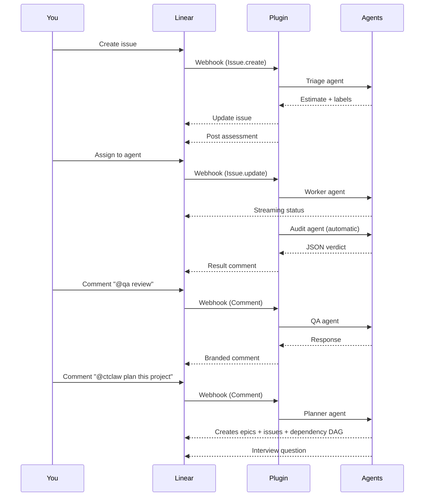
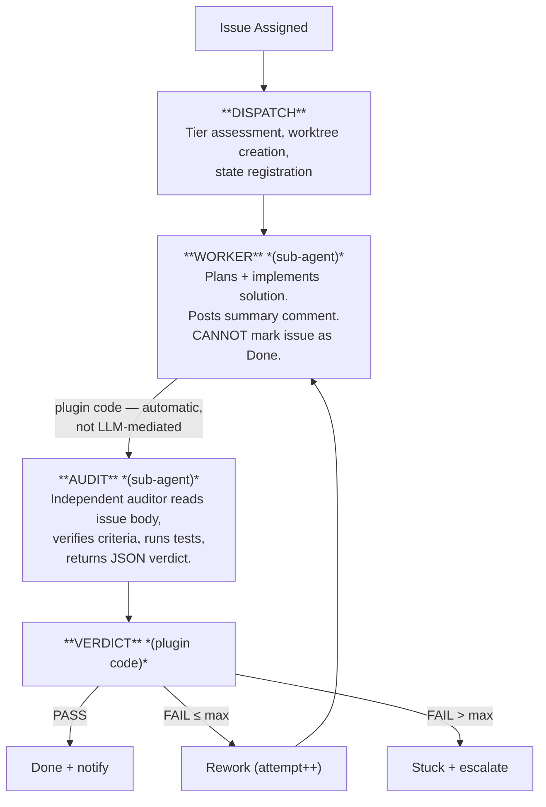
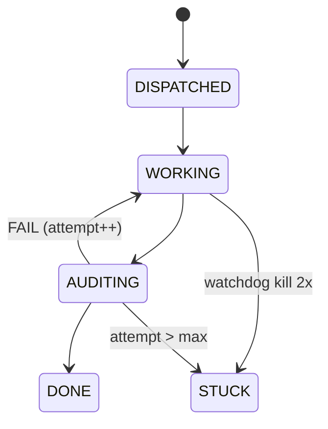
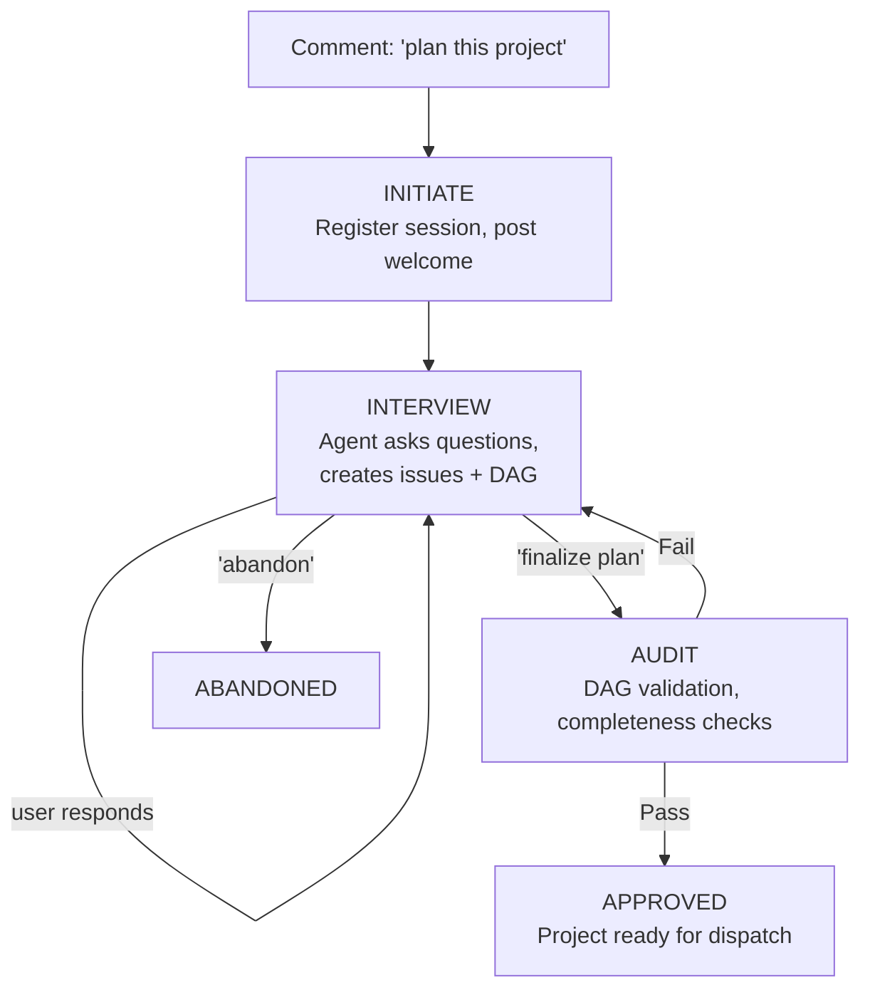
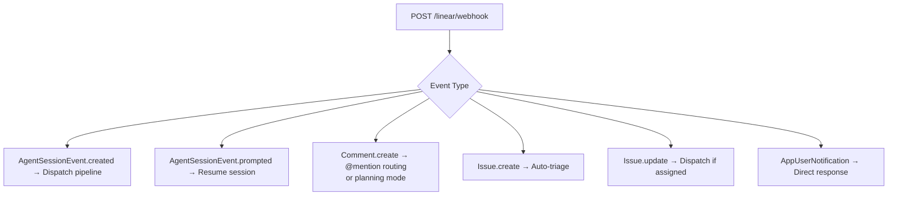
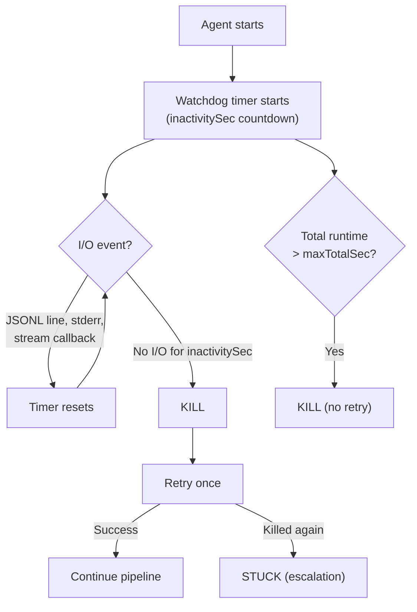

# @calltelemetry/openclaw-linear

[](https://github.com/calltelemetry/openclaw)
[](LICENSE)

An OpenClaw plugin that connects Linear to AI agents. Issues get triaged automatically, agents respond to `@mentions`, and a worker-audit pipeline runs when you assign work -- with an inactivity watchdog that kills and respawns stuck sessions.

---

## Table of Contents

- [Features](#features)
- [How It Works](#how-it-works)
- [Architecture](#architecture)
- [Project Layout](#project-layout)
- [Getting Started](#getting-started)
- [Usage](#usage)
- [Configuration](#configuration)
- [Prompt Customization](#prompt-customization)
- [Notifications](#notifications)
- [Coding Tool](#coding-tool-code_run)
- [Inactivity Watchdog](#inactivity-watchdog)
- [CLI Reference](#cli-reference)
- [Troubleshooting](#troubleshooting)
- [License](#license)

---

## Features

| Feature | Description |
|---------|-------------|
| **Auto-triage** | New issues get story point estimates, labels, and priority automatically |
| **@mention routing** | `@qa`, `@infra`, `@docs` in comments route to specialized agents |
| **Worker-audit pipeline** | Assign an issue and a worker implements it, then an independent auditor verifies |
| **Hard-enforced audit** | Audit triggers in plugin code, not as an LLM decision. Workers cannot self-certify. |
| **Inactivity watchdog** | Kills agent sessions with no I/O, retries once, escalates on double failure |
| **Branded replies** | Each agent posts with its own name and avatar in Linear |
| **Real-time progress** | Agent activity (thinking, acting, responding) streams to Linear's UI |
| **Unified `code_run`** | One tool, three backends (Codex, Claude Code, Gemini), configurable per agent |
| **Issue management** | Agents use `linearis` CLI to update status, close issues, add comments |
| **Project planner** | Interactive interview builds out Linear issue hierarchies with dependency DAGs |
| **Customizable prompts** | `prompts.yaml` -- edit worker, audit, planner, and rework prompts without rebuilding |
| **Multi-channel notifications** | Dispatch events fan out to Discord, Slack, Telegram, Signal, or any OpenClaw channel |
| **Artifact logging** | Every dispatch writes structured logs to `.claw/` in the worktree |

---

## How It Works



---

## Architecture

### Dispatch Pipeline (v2)

When an issue is assigned, the plugin runs a multi-stage pipeline:



### Hard-Enforced vs. LLM-Mediated

| Layer | Mechanism | Can be skipped? |
|-------|-----------|-----------------|
| Worker spawn | Plugin code (`runAgent`) | No |
| Audit trigger | Plugin code (fires after worker completes) | No |
| Verdict processing | Plugin code (pass/fail/escalate) | No |
| Inactivity watchdog | Plugin code (timer-based kill + retry) | No |
| Worker implementation | LLM-mediated (agent decides how to code) | N/A |
| Audit evaluation | LLM-mediated (agent decides if criteria are met) | N/A |

### State Machine



All transitions use compare-and-swap (CAS) to prevent races. `dispatch-state.json` is the canonical source of truth.

### Project Planner Pipeline

When `@ctclaw plan this project` is commented on a root issue, the plugin enters planning mode:



During planning mode, the planner creates epics, sub-issues, and dependency relationships (`blocks`/`blocked_by`) via 5 dedicated tools. Issue dispatch is blocked for projects in planning mode.

### Webhook Event Router



All handlers respond `200 OK` within 5 seconds (Linear requirement), then process asynchronously.

### Two Webhook Systems

Linear delivers events through two separate webhook paths:

1. **Workspace webhook** (Settings > API > Webhooks) -- Comment, Issue, User events
2. **OAuth app webhook** (Settings > API > Applications) -- `AgentSessionEvent` (created/prompted)

Both must point to: `https://<your-domain>/linear/webhook`

### Deduplication

A 60-second sliding window prevents double-handling:

| Key Pattern | Prevents |
|---|---|
| `session:{id}` | Same session processed by both Issue.update and AgentSessionEvent |
| `comment:{id}` | Same comment webhook delivered twice |
| `assigned:{issueId}:{viewerId}` | Rapid re-assignment events |
| `issue-create:{id}` | Duplicate Issue.create webhooks |

---

## Project Layout

```
openclaw-linear/
|-- index.ts                  Plugin entry point, route/hook/service registration
|-- openclaw.plugin.json      Plugin metadata and config schema
|-- prompts.yaml              Externalized worker/audit/rework prompt templates
|-- coding-tools.json         Backend config (default tool, per-agent overrides)
|-- package.json
|-- README.md
|-- docs/
|   |-- architecture.md       Internal architecture reference
|   +-- troubleshooting.md    Diagnostic commands and common issues
+-- src/
    |-- pipeline/              Core dispatch lifecycle
    |   |-- webhook.ts             Event router -- 6 webhook handlers, dispatch logic
    |   |-- pipeline.ts            v2 pipeline: spawnWorker, triggerAudit, processVerdict
    |   |-- dispatch-state.ts      File-backed state, CAS transitions, session mapping
    |   |-- dispatch-service.ts    Background monitor: stale detection, recovery, cleanup
    |   |-- active-session.ts      In-memory session registry (issueId -> session)
    |   |-- tier-assess.ts         Issue complexity assessment (junior/medior/senior)
    |   |-- artifacts.ts           .claw/ directory: manifest, logs, verdicts, summaries
    |   |-- planner.ts             Project planner orchestration (interview, audit)
    |   +-- planning-state.ts      File-backed planning state (mirrors dispatch-state)
    |
    |-- agent/                 Agent execution & monitoring
    |   |-- agent.ts               Embedded runner + subprocess fallback, retry on watchdog kill
    |   +-- watchdog.ts            InactivityWatchdog class + per-agent config resolver
    |
    |-- tools/                 Tool registration & CLI backends
    |   |-- tools.ts               Tool registration (code_run + orchestration)
    |   |-- code-tool.ts           Unified code_run dispatcher
    |   |-- cli-shared.ts          Shared helpers (buildLinearApi, resolveSession, defaults)
    |   |-- claude-tool.ts         Claude Code CLI runner (JSONL -> Linear activities)
    |   |-- codex-tool.ts          Codex CLI runner (JSONL -> Linear activities)
    |   |-- gemini-tool.ts         Gemini CLI runner (JSONL -> Linear activities)
    |   |-- orchestration-tools.ts spawn_agent / ask_agent for multi-agent delegation
    |   +-- planner-tools.ts       5 planning tools (create/link/update issues, audit DAG)
    |
    |-- api/                   Linear API & auth
    |   |-- linear-api.ts          GraphQL client, token resolution, auto-refresh
    |   |-- auth.ts                OAuth provider registration
    |   +-- oauth-callback.ts      HTTP handler for OAuth redirect
    |
    +-- infra/                 Infrastructure utilities
        |-- cli.ts                 CLI subcommands (auth, status, worktrees, prompts)
        |-- codex-worktree.ts      Git worktree create/remove/status/PR helpers
        +-- notify.ts              Multi-channel notifier (Discord, Slack, Telegram, Signal)
```

---

## Getting Started

### Prerequisites

- **OpenClaw** gateway running (v2026.2+)
- **Linear** workspace with API access
- **Public URL** for webhook delivery (Cloudflare Tunnel recommended)
- **Coding CLIs** (at least one): `codex`, `claude`, `gemini` -- installed in PATH
- **linearis** CLI -- for issue management

### 1. Install the Plugin

```bash
openclaw plugins install @calltelemetry/openclaw-linear
```

### 2. Create a Linear OAuth App

Go to **Linear Settings > API > Applications** and create a new application:

- **Webhook URL:** `https://<your-domain>/linear/webhook`
- **Redirect URI:** `https://<your-domain>/linear/oauth/callback`
- Enable webhook events: **Agent Sessions**, **Comments**, **Issues**

Save the **Client ID** and **Client Secret**.

### 3. Set Credentials

Add to your gateway environment or plugin config:

```bash
export LINEAR_CLIENT_ID="your_client_id"
export LINEAR_CLIENT_SECRET="your_client_secret"
```

For systemd:

```ini
[Service]
Environment=LINEAR_CLIENT_ID=your_client_id
Environment=LINEAR_CLIENT_SECRET=your_client_secret
```

Then reload: `systemctl --user daemon-reload && systemctl --user restart openclaw-gateway`

### 4. Expose the Gateway

Linear needs HTTPS access to deliver webhooks. [Cloudflare Tunnel](https://developers.cloudflare.com/cloudflare-one/connections/connect-networks/) is recommended.

```bash
# Install cloudflared
sudo dnf install -y cloudflared   # RHEL/Rocky/Alma

# Create and configure tunnel
cloudflared tunnel login
cloudflared tunnel create openclaw
cloudflared tunnel route dns openclaw linear.yourdomain.com
```

Create `~/.cloudflared/config.yml`:

```yaml
tunnel: <TUNNEL_ID>
credentials-file: ~/.cloudflared/<TUNNEL_ID>.json

ingress:
  - hostname: linear.yourdomain.com
    service: http://localhost:18789
  - service: http_status:404
```

Start the tunnel:

```bash
sudo cloudflared service install
sudo systemctl enable --now cloudflared
```

Verify:

```bash
curl -s https://linear.yourdomain.com/linear/webhook \
  -X POST -H "Content-Type: application/json" \
  -d '{"type":"test","action":"ping"}'
# Should return: "ok"
```

### 5. Authorize with Linear

```bash
openclaw openclaw-linear auth
```

This opens your browser to authorize the agent. Then restart and verify:

```bash
systemctl --user restart openclaw-gateway
openclaw openclaw-linear status
```

### 6. Configure Agents

Create `~/.openclaw/agent-profiles.json`:

```json
{
  "agents": {
    "coder": {
      "label": "Coder",
      "mission": "Full-stack engineer. Plans, implements, and ships code.",
      "isDefault": true,
      "mentionAliases": ["coder"],
      "avatarUrl": "https://example.com/coder.png",
      "watchdog": {
        "inactivitySec": 180,
        "maxTotalSec": 7200,
        "toolTimeoutSec": 900
      }
    },
    "qa": {
      "label": "QA",
      "mission": "Test engineer. Quality guardian, test strategy.",
      "mentionAliases": ["qa", "tester"],
      "watchdog": {
        "inactivitySec": 120,
        "maxTotalSec": 3600,
        "toolTimeoutSec": 600
      }
    }
  }
}
```

Each agent name must match an agent in `~/.openclaw/openclaw.json`. One agent must have `isDefault: true` -- this agent handles issue assignments and the dispatch pipeline.

### 7. Configure Coding Tools

Create `coding-tools.json` in the plugin root:

```json
{
  "codingTool": "claude",
  "agentCodingTools": {},
  "backends": {
    "claude": { "aliases": ["claude", "claude code", "anthropic"] },
    "codex": { "aliases": ["codex", "openai"] },
    "gemini": { "aliases": ["gemini", "google"] }
  }
}
```

### 8. Install linearis

```bash
npm install -g linearis
npx clawhub install linearis
echo "lin_api_YOUR_KEY" > ~/.linear_api_token
```

### 9. Verify

```bash
systemctl --user restart openclaw-gateway
```

Check logs for a clean startup:

```
[plugins] Linear agent extension registered (agent: default, token: profile,
  codex: codex-cli 0.101.0, claude: 2.1.45, gemini: 0.28.2, orchestration: enabled)
```

Test the webhook:

```bash
curl -s -X POST https://your-domain.com/linear/webhook \
  -H "Content-Type: application/json" \
  -d '{"type":"test","action":"ping"}'
# Should return: "ok"
```

---

## Usage

Once set up, the plugin responds to Linear events automatically:

| What you do in Linear | What happens |
|---|---|
| Create a new issue | Agent triages it (estimate, labels, priority) and posts an assessment |
| Assign an issue to the agent | Worker-audit pipeline runs with watchdog protection |
| Trigger an agent session | Agent responds directly in the session |
| Comment `@qa check the tests` | QA agent responds with its expertise |
| Comment `@ctclaw plan this project` | Planner agent enters interview mode, builds issue DAG |
| Reply during planning mode | Planner creates/updates issues and asks next question |
| Comment "finalize plan" | DAG audit runs: cycles, orphans, missing estimates/priorities |
| Ask "close this issue" | Agent runs `linearis issues update API-123 --status Done` |
| Ask "use gemini to review" | Agent calls `code_run` with `backend: "gemini"` |

### Pipeline Behavior

When an issue is assigned:

1. **Tier assessment** -- Evaluates complexity (junior/medior/senior), selects model tier
2. **Worktree creation** -- Isolated git worktree for the implementation
3. **Worker runs** -- Worker agent plans and implements, posts summary comment
4. **Audit runs** -- Independent auditor verifies against issue body, returns JSON verdict
5. **Verdict** -- Pass: issue done. Fail: worker re-spawns with gaps (up to `maxReworkAttempts`). Too many failures: stuck + escalation notification.
6. **Watchdog** -- If the worker goes silent (no I/O), the watchdog kills it and retries once. Double failure escalates to stuck.

Workers **cannot** mark issues as done -- that's handled entirely by plugin verdict processing code.

---

## Configuration

### Plugin Config

Set in `openclaw.json` under the plugin entry:

| Key | Type | Default | Description |
|---|---|---|---|
| `defaultAgentId` | string | `"default"` | Agent ID for pipeline workers and audit |
| `enableAudit` | boolean | `true` | Run auditor stage after implementation |
| `enableOrchestration` | boolean | `true` | Allow `spawn_agent`/`ask_agent` tools |
| `codexBaseRepo` | string | `"/home/claw/ai-workspace"` | Git repo for worktrees |
| `codexModel` | string | -- | Default Codex model |
| `codexTimeoutMs` | number | `600000` | Legacy timeout for coding CLIs (ms) |
| `worktreeBaseDir` | string | `"~/.openclaw/worktrees"` | Base directory for worktrees |
| `dispatchStatePath` | string | `"~/.openclaw/linear-dispatch-state.json"` | Dispatch state file |
| `notifications` | object | -- | [Notification targets and event toggles](#notifications) |
| `promptsPath` | string | -- | Override path for `prompts.yaml` |
| `maxReworkAttempts` | number | `2` | Max audit failures before escalation |
| `inactivitySec` | number | `120` | Kill sessions with no I/O for this long |
| `maxTotalSec` | number | `7200` | Max total agent session runtime |
| `toolTimeoutSec` | number | `600` | Max runtime for a single `code_run` invocation |

### Environment Variables

| Variable | Required | Description |
|---|---|---|
| `LINEAR_CLIENT_ID` | Yes | OAuth app client ID |
| `LINEAR_CLIENT_SECRET` | Yes | OAuth app client secret |
| `LINEAR_API_KEY` | No | Personal API key (fallback if no OAuth) |
| `LINEAR_REDIRECT_URI` | No | Override the OAuth callback URL |
| `OPENCLAW_GATEWAY_PORT` | No | Gateway port (default: 18789) |

### Agent Profile Fields

| Field | Required | Description |
|---|---|---|
| `label` | Yes | Display name on Linear comments |
| `mission` | Yes | Role description (injected as context) |
| `isDefault` | One agent | Handles triage and the dispatch pipeline |
| `mentionAliases` | Yes | `@mention` triggers (e.g., `["qa", "tester"]`) |
| `avatarUrl` | No | Avatar URL for branded comments |
| `watchdog.inactivitySec` | No | Inactivity kill threshold (default: 120) |
| `watchdog.maxTotalSec` | No | Max total session runtime (default: 7200) |
| `watchdog.toolTimeoutSec` | No | Max single `code_run` runtime (default: 600) |

---

## Prompt Customization

Worker, audit, and rework prompts live in `prompts.yaml`. Edit to customize without rebuilding.

### Managing Prompts

```bash
openclaw openclaw-linear prompts show       # Print current prompts.yaml
openclaw openclaw-linear prompts path       # Print resolved file path
openclaw openclaw-linear prompts validate   # Validate structure and template variables
```

### Template Variables

| Variable | Description |
|---|---|
| `{{identifier}}` | Issue identifier (e.g., `API-123`) |
| `{{title}}` | Issue title |
| `{{description}}` | Full issue body |
| `{{worktreePath}}` | Path to the git worktree |
| `{{tier}}` | Assessed complexity tier |
| `{{attempt}}` | Current attempt number (0-based) |
| `{{gaps}}` | Audit gaps from previous attempt (rework only) |

### Override Path

```json
{
  "plugins": {
    "entries": {
      "openclaw-linear": {
        "config": {
          "promptsPath": "/path/to/my/prompts.yaml"
        }
      }
    }
  }
}
```

---

## Notifications

Dispatch lifecycle events fan out to any combination of OpenClaw channels -- Discord, Slack, Telegram, Signal, or any channel the runtime supports.

### Configuration

Add a `notifications` object to your plugin config:

```json
{
  "plugins": {
    "entries": {
      "openclaw-linear": {
        "config": {
          "notifications": {
            "targets": [
              { "channel": "discord", "target": "1471743433566715974" },
              { "channel": "slack", "target": "C0123456789", "accountId": "my-acct" },
              { "channel": "telegram", "target": "-1003884997363" }
            ],
            "events": {
              "auditing": false
            }
          }
        }
      }
    }
  }
}
```

**`targets`** -- Array of notification destinations. Each target specifies:

| Field | Required | Description |
|---|---|---|
| `channel` | Yes | OpenClaw channel name: `discord`, `slack`, `telegram`, `signal`, etc. |
| `target` | Yes | Channel/group/user ID to send to |
| `accountId` | No | Account ID for multi-account setups (Slack) |

**`events`** -- Per-event-type toggles. All events are enabled by default. Set to `false` to suppress.

### Events

| Event | Kind | Example Message |
|---|---|---|
| Dispatch | `dispatch` | `API-123 dispatched -- Fix auth bug` |
| Worker started | `working` | `API-123 worker started (attempt 0)` |
| Audit in progress | `auditing` | `API-123 audit in progress` |
| Audit passed | `audit_pass` | `API-123 passed audit. PR ready.` |
| Audit failed | `audit_fail` | `API-123 failed audit (attempt 1). Gaps: no tests, missing validation` |
| Escalation | `escalation` | `API-123 needs human review -- audit failed 3x` |
| Stale detection | `stuck` | `API-123 stuck -- stale 2h` |
| Watchdog kill | `watchdog_kill` | `API-123 killed by watchdog (no I/O for 120s). Retrying (attempt 0).` |

### Delivery

Messages route through OpenClaw's native runtime channel API:

- **Discord** -- `runtime.channel.discord.sendMessageDiscord()`
- **Slack** -- `runtime.channel.slack.sendMessageSlack()` (passes `accountId` for multi-workspace)
- **Telegram** -- `runtime.channel.telegram.sendMessageTelegram()` (silent mode)
- **Signal** -- `runtime.channel.signal.sendMessageSignal()`
- **Other** -- Falls back to `openclaw message send` CLI

Failures are isolated per target -- one channel going down doesn't block the others.

### Notify CLI

```bash
openclaw openclaw-linear notify status                  # Show configured targets and suppressed events
openclaw openclaw-linear notify test                    # Send test notification to all targets
openclaw openclaw-linear notify test --channel discord  # Test only discord targets
openclaw openclaw-linear notify setup                   # Interactive target setup
```

---

## Coding Tool (`code_run`)

One tool dispatches to three CLI backends. Agents call `code_run` without knowing which backend is active.

### Supported Backends

| Backend | CLI | Stream Format | Key Flags |
|---|---|---|---|
| **Claude Code** (Anthropic) | `claude` | JSONL (`stream-json`) | `--print`, `--dangerously-skip-permissions` |
| **Codex** (OpenAI) | `codex` | JSONL | `--full-auto`, `--ephemeral` |
| **Gemini CLI** (Google) | `gemini` | JSONL (`stream-json`) | `--yolo`, `-o stream-json` |

All three backends have inactivity watchdog protection. Each line of JSONL output ticks the watchdog timer. If a CLI goes silent beyond the configured threshold, the process is killed with SIGTERM (+ SIGKILL after 5s).

### Backend Resolution Priority

1. **Explicit `backend` parameter** -- Agent passes `backend: "gemini"` (or any alias)
2. **Per-agent override** -- `agentCodingTools` in `coding-tools.json`
3. **Global default** -- `codingTool` in `coding-tools.json`
4. **Hardcoded fallback** -- `"claude"`

---

## Inactivity Watchdog

Agent sessions can go silent when LLM providers rate-limit, APIs hang, or CLI tools lock up. The watchdog detects silence and kills stuck sessions.

### How It Works



### Three Timeout Dimensions

| Timeout | Scope | Default | Description |
|---------|-------|---------|-------------|
| `inactivitySec` | Per I/O gap | 120s (2 min) | Kill if no stdout/stderr/callback for this long |
| `maxTotalSec` | Per agent session | 7200s (2 hrs) | Hard ceiling on total session runtime |
| `toolTimeoutSec` | Per `code_run` call | 600s (10 min) | Max runtime for a single CLI invocation |

### Config Resolution Order

1. **Agent profile** -- `~/.openclaw/agent-profiles.json` `agents.{id}.watchdog`
2. **Plugin config** -- `openclaw.json` `inactivitySec` / `maxTotalSec` / `toolTimeoutSec`
3. **Hardcoded defaults** -- 120s / 7200s / 600s

### Per-Agent Configuration

```json
{
  "agents": {
    "coder": {
      "watchdog": {
        "inactivitySec": 180,
        "maxTotalSec": 7200,
        "toolTimeoutSec": 900
      }
    },
    "reviewer": {
      "watchdog": {
        "inactivitySec": 60,
        "maxTotalSec": 600,
        "toolTimeoutSec": 300
      }
    }
  }
}
```

### Artifact Logging

Every dispatch writes structured artifacts to `.claw/` in the worktree:

```
.claw/
  manifest.json       Issue metadata + lifecycle timestamps
  plan.md             Implementation plan
  worker-{N}.md       Worker output per attempt (truncated to 8KB)
  audit-{N}.json      Audit verdict per attempt
  log.jsonl           Append-only structured interaction log
  summary.md          Agent-curated final summary
```

Watchdog kills are logged to `log.jsonl` with phase `"watchdog"`:

```json
{
  "ts": "2026-02-18T12:00:00Z",
  "phase": "watchdog",
  "attempt": 0,
  "agent": "coder",
  "success": false,
  "watchdog": {
    "reason": "inactivity",
    "silenceSec": 120,
    "thresholdSec": 120,
    "retried": true
  }
}
```

---

## CLI Reference

```bash
openclaw openclaw-linear auth              # Run OAuth authorization
openclaw openclaw-linear status            # Check connection and token status
openclaw openclaw-linear worktrees         # List active worktrees
openclaw openclaw-linear worktrees --prune <path>  # Remove a worktree
openclaw openclaw-linear prompts show      # Print current prompts
openclaw openclaw-linear prompts path      # Print resolved prompts file path
openclaw openclaw-linear prompts validate  # Validate prompt structure
openclaw openclaw-linear notify status     # Show notification targets and event toggles
openclaw openclaw-linear notify test       # Send test notification to all targets
openclaw openclaw-linear notify test --channel slack  # Test specific channel only
openclaw openclaw-linear notify setup      # Interactive notification target setup
openclaw openclaw-linear doctor            # Run comprehensive health checks
openclaw openclaw-linear doctor --fix      # Auto-fix safe issues
openclaw openclaw-linear doctor --json     # Output results as JSON
```

---

## Troubleshooting

Quick checks:

```bash
systemctl --user status openclaw-gateway        # Is the gateway running?
openclaw openclaw-linear status                  # Is the token valid?
journalctl --user -u openclaw-gateway -f         # Watch live logs
linearis issues list -l 1                        # Is linearis authenticated?
openclaw openclaw-linear prompts validate        # Are prompts valid?
```

### Common Issues

| Problem | Cause | Fix |
|---|---|---|
| Agent goes silent, no response | LLM provider timeout or rate limit | Watchdog auto-kills after `inactivitySec` and retries. Check logs for `Watchdog KILL`. |
| Dispatch stuck after watchdog | Both retry attempts failed | Check `.claw/log.jsonl` for watchdog entries. Re-assign issue to retry. |
| Agent says "closing" but doesn't | No issue management tool | Install `linearis`: `npx clawhub install linearis` |
| `code_run` uses wrong backend | Config mismatch | Check `coding-tools.json` |
| Claude Code "nested session" error | `CLAUDECODE` env var set | Plugin handles this automatically |
| Gateway rejects plugin config keys | Strict validator | Custom config goes in `coding-tools.json` |
| Webhook events not arriving | Wrong URL | Both webhooks must point to `/linear/webhook` |
| OAuth token expired | Tokens expire ~24h | Auto-refreshes; restart gateway if stuck |
| Audit always fails | Bad prompt template | Run `openclaw openclaw-linear prompts validate` |

See [docs/troubleshooting.md](docs/troubleshooting.md) for detailed diagnostic commands.

---

## License

MIT
