<p align="center">
  
</p>

# @calltelemetry/openclaw-linear

[](https://github.com/calltelemetry/openclaw-linear-plugin/actions/workflows/ci.yml)
[](https://codecov.io/gh/calltelemetry/openclaw-linear-plugin)
[](https://www.npmjs.com/package/@calltelemetry/openclaw-linear)
[](https://github.com/calltelemetry/openclaw)
[](LICENSE)

Connect Linear to AI agents. Issues get triaged, implemented, and audited — automatically.

> **Real human here.** I'm actively building this and beta testing it on real projects.
> Looking for feedback, bug reports, and fellow mad scientists.
> [Open an issue](https://github.com/calltelemetry/openclaw-linear-plugin/issues) — feedback and bug reports welcome.

### Project Status

- [x] Cloudflare tunnel setup (webhook ingress, no inbound ports)
- [x] Linear webhook sync (Comment + Issue events)
- [x] Linear OAuth app webhook (AgentSessionEvent created/prompted)
- [x] Linear API integration (issues, comments, labels, state transitions)
- [x] Agent routing (`@mentions`, natural language intent classifier)
- [x] Intent gate + scope enforcement (all 4 webhook paths, 3-layer defense)
- [x] Auto-triage (story points, labels, priority — read-only)
- [x] Complexity-tier dispatch (small → Haiku, medium → Sonnet, high → Opus)
- [x] Isolated git worktrees per dispatch
- [x] Worker → Auditor pipeline (hard-enforced, not LLM-mediated)
- [x] Audit rework loop (gaps fed back, automatic retry)
- [x] Watchdog timeout + escalation
- [x] Webhook deduplication (60s sliding window + `activeRuns` race guard on all paths)
- [x] Webhook auto-provisioning (`webhooks setup` CLI, `doctor --fix`)
- [x] Multi-repo worktree support
- [x] Project planner (interview → user stories → sub-issues → DAG dispatch)
- [x] Cross-model plan review (Claude ↔ Codex ↔ Gemini)
- [x] Issue closure with summary report
- [x] Sub-issue decomposition (orchestrator-level only)
- [x] `spawn_agent` / `ask_agent` sub-agent tools
- [x] CI + coverage badges (1170+ tests, Codecov integration)
- [x] Setup wizard (`openclaw openclaw-linear setup`) + `doctor --fix` auto-repair
- [x] Project context auto-detection (repo, framework, build/test commands → worker/audit prompts)
- [x] Per-backend CLI tools (`cli_codex`, `cli_claude`, `cli_gemini`) with Linear session activity streaming
- [ ] **Worktree → PR merge** — `createPullRequest()` exists but is not wired into the pipeline. After audit pass, commits sit on a `codex/{identifier}` branch. You create the PR manually.
- [ ] **Sub-agent worktree sharing** — Sub-agents spawned via `spawn_agent`/`ask_agent` do not inherit the parent worktree. They run in their own session without code access.
- [ ] **Parallel worktree conflict resolution** — DAG dispatch runs up to 3 issues concurrently in separate worktrees, but there's no merge conflict detection across them.

---

## Why This Exists

Linear is a great project tracker. But it doesn't orchestrate AI agents — it just gives you issues, comments, and sessions. Without something bridging that gap, every stage of an AI-driven workflow requires a human in the loop: copy the issue context, start an agent, wait, read the output, decide what's next, start another agent, paste in the feedback, repeat. That's not autonomous — that's babysitting.

This plugin makes the full lifecycle hands-off:

```
  You create an issue
       │
       ▼
  Agent triages it ──── estimate, labels, priority
       │
       ▼
  You assign it
       │
       ▼
  Plugin dispatches ─── picks model tier, creates worktree
       │
       ▼
  Worker implements ─── code, tests, commits
       │
       ▼
  Auditor verifies ─── independent, hard-enforced
       │
   ┌───┴───┐
   ▼       ▼
  Done    Rework ────── gaps fed back, retry automatic
```

You work in Linear. The agents handle the rest.

**What Linear can't do on its own — and what this plugin handles:**

| Gap | What the plugin does |
|---|---|
| **No agent orchestration** | Assesses complexity, picks the right model tier, creates isolated worktrees, runs workers, triggers audits, processes verdicts — all from a single issue assignment |
| **No independent verification** | Hard-enforces a worker → auditor boundary in plugin code. The worker cannot mark its own work done. The audit is not optional and not LLM-mediated. |
| **No failure recovery** | Watchdog kills hung agents after configurable silence. Feeds audit failures back as rework context. Escalates when retries are exhausted. |
| **No multi-agent routing** | Routes `@mentions` and natural language ("hey kaylee look at this") to specific agents. Intent classifier handles plan requests, questions, close commands, and work requests. |
| **No project-scale planning** | Planner interviews you, creates issues with user stories and acceptance criteria, runs a cross-model review, then dispatches the full dependency graph — up to 3 issues in parallel. |

The end result: you work in Linear. You create issues, assign them, comment in plain English. The agents do the rest — or tell you when they can't.

---

## Features

### Core Pipeline

- **Auto-triage** — New issues get story point estimates, labels, and priority within seconds. Read-only mode — no side effects.
- **Worker → Auditor pipeline** — Assign an issue and a worker implements it in an isolated git worktree. An independent auditor verifies the work. The worker cannot self-certify — the audit is hard-enforced in plugin code.
- **Complexity-tier dispatch** — The plugin assesses each issue and picks the right model. Simple typo? Haiku. Multi-service refactor? Opus. Saves cost and latency without manual intervention.
- **Automatic rework** — Failed audits feed gaps back to the worker as context. Retries up to N times before escalating. No human needed until the agents are stuck.

### Planning & Closure

- **Project planner** — Comment "plan this project" and the agent interviews you, builds user stories with acceptance criteria, creates the full issue hierarchy, and dispatches in dependency order — up to 3 issues in parallel.
- **Cross-model review** — Plans are automatically audited by a different AI model (Claude ↔ Codex ↔ Gemini) before dispatch. Two perspectives, one plan.
- **Issue closure** — Say "close this" or "mark as done" and the agent generates a closure report and transitions the issue to completed.
- **Sub-issue decomposition** — Orchestrators and the planner break complex work into sub-issues via `linear_issues`. Sub-issues inherit team and project from the parent automatically.

### Multi-Agent & Routing

- **Named agents** — Define agents with different roles and expertise. Route work by `@mention` or natural language ("hey kaylee look at this").
- **Intent classification** — An LLM classifier (~300 tokens, ~2s) runs on every user request across all webhook paths — not just comments. Classifies intent and gates work requests on untriaged issues. Regex fallback if the classifier fails.
- **Scope enforcement** — Three-layer defense prevents agents from building code on issues that haven't been planned. Intent gate blocks `request_work` pre-dispatch; prompt-level constraints limit CLI tools to planning-only; a `before_tool_call` hook prepends hard constraints to worker prompts.
- **One-time detour** — `@mention` a different agent in a session and it handles that single interaction. The session stays with the original agent.

### Multi-Backend & Multi-Repo

- **Three coding backends** — Codex (OpenAI), Claude (Anthropic), Gemini (Google). Configurable globally or per-agent. Each backend registers as a dedicated tool (`cli_codex`, `cli_claude`, `cli_gemini`) so agents and Linear session UI show exactly which backend is running. Per-agent overrides let you assign different backends to different team members.
- **Multi-repo dispatch** — Tag an issue with `<!-- repos: api, frontend -->` and the worker gets isolated worktrees for each repo. One issue, multiple codebases, one agent session.

### Operations

- **Linear Guidance** — Workspace and team-level guidance configured in Linear's admin UI flows into every agent prompt — triage, dispatch, worker, audit. Admins steer agent behavior without touching config files.
- **Watchdog** — Kills agents that go silent after configurable inactivity. Retries once, then escalates. Covers LLM hangs, API timeouts, and CLI lockups.
- **Notifications** — Dispatch lifecycle events (started, auditing, done, stuck) to Discord, Slack, Telegram, or Signal. Rich formatting optional.
- **Webhook deduplication** — Two-tier guard (in-memory set + 60s TTL map) prevents double-processing across Linear's two webhook systems.

---

## Quick Start

### 1. Install the plugin

```bash
openclaw plugins install @calltelemetry/openclaw-linear
```

### 2. Expose the gateway

Linear delivers webhooks over the public internet, so the gateway needs a public HTTPS URL. See [Tunnel Setup (Cloudflare)](#tunnel-setup-cloudflare) for the recommended approach. Any reverse proxy or tunnel that forwards HTTPS to `localhost:18789` will work.

### 3. Create a Linear OAuth app

Go to **Linear Settings > API > Applications** and create an app:

- Set **Webhook URL** to `https://your-domain.com/linear/webhook`
- Set **Redirect URI** to `https://your-domain.com/linear/oauth/callback`
- Enable events: **Agent Sessions**, **Comments**, **Issues**
- Save your **Client ID** and **Client Secret**

> You also need a **workspace webhook** — run `openclaw openclaw-linear webhooks setup` to auto-provision it, or manually create one in Settings > API > Webhooks pointing to the same URL with **Comment + Issue** events enabled. Both webhooks are required.

### 4. Set credentials

```bash
export LINEAR_CLIENT_ID="your_client_id"
export LINEAR_CLIENT_SECRET="your_client_secret"
```

For systemd services, add these to your unit file:

```ini
[Service]
Environment=LINEAR_CLIENT_ID=your_client_id
Environment=LINEAR_CLIENT_SECRET=your_client_secret
```

Then reload: `systemctl --user daemon-reload && systemctl --user restart openclaw-gateway`

### 5. Authorize

```bash
openclaw openclaw-linear auth
```

This opens your browser. Approve the authorization, then restart:

```bash
systemctl --user restart openclaw-gateway
```

### 6. Verify

```bash
openclaw openclaw-linear status
```

You should see a valid token and connected status. Check the gateway logs for a clean startup:

```
Linear agent extension registered (agent: default, token: profile, orchestration: enabled)
```

Test the webhook endpoint:

```bash
curl -s -X POST https://your-domain.com/linear/webhook \
  -H "Content-Type: application/json" \
  -d '{"type":"test","action":"ping"}'
# Returns: "ok"
```

That's it. Create an issue in Linear and watch the agent respond.

---

## Tunnel Setup (Cloudflare)

Linear delivers webhooks over the public internet. The gateway listens on `localhost:18789` and needs a public HTTPS endpoint. A [Cloudflare Tunnel](https://developers.cloudflare.com/cloudflare-one/connections/connect-networks/) is the recommended approach — no open ports, no TLS cert management, no static IP required.


**How it works:** `cloudflared` opens an outbound connection to Cloudflare's edge and keeps it alive. Cloudflare routes incoming HTTPS requests for your hostname back through the tunnel to `localhost:18789`. No inbound firewall rules needed.

### Install cloudflared

```bash
# RHEL / Rocky / Alma
sudo dnf install -y cloudflared

# Debian / Ubuntu
curl -fsSL https://pkg.cloudflare.com/cloudflare-main.gpg | sudo tee /usr/share/keyrings/cloudflare-main.gpg >/dev/null
echo "deb [signed-by=/usr/share/keyrings/cloudflare-main.gpg] https://pkg.cloudflare.com/cloudflared $(lsb_release -cs) main" \
  | sudo tee /etc/apt/sources.list.d/cloudflared.list
sudo apt update && sudo apt install -y cloudflared

# macOS
brew install cloudflare/cloudflare/cloudflared
```

### Authenticate with Cloudflare

```bash
cloudflared tunnel login
```

This opens your browser. You must:
1. Log in to your Cloudflare account
2. **Select the domain** (zone) for the tunnel (e.g., `yourdomain.com`)
3. Click **Authorize**

Cloudflare writes an origin certificate to `~/.cloudflared/cert.pem`. This cert grants `cloudflared` permission to create tunnels and DNS records under that domain.

> **Prerequisite:** Your domain must already be on Cloudflare (nameservers pointed to Cloudflare). If it's not, add it in the Cloudflare dashboard first.

### Create a tunnel

```bash
cloudflared tunnel create openclaw-linear
```

This outputs a **Tunnel ID** (UUID like `da1f21bf-856e-...`) and writes credentials to `~/.cloudflared/<TUNNEL_ID>.json`.

### DNS — point your hostname to the tunnel

```bash
cloudflared tunnel route dns openclaw-linear linear.yourdomain.com
```

This creates a CNAME record in Cloudflare DNS: `linear.yourdomain.com → <TUNNEL_ID>.cfargotunnel.com`. You can verify it in the Cloudflare dashboard under **DNS > Records**. You can also create this record manually.

The hostname you choose here is what you'll use for **both** webhook URLs and the OAuth redirect URI in Linear. Make sure they all match.

### Configure the tunnel

Create `/etc/cloudflared/config.yml` (system-wide) or `~/.cloudflared/config.yml` (user):

```yaml
tunnel: <TUNNEL_ID>
credentials-file: /home/<user>/.cloudflared/<TUNNEL_ID>.json

ingress:
  - hostname: linear.yourdomain.com
    service: http://localhost:18789
  - service: http_status:404    # catch-all, reject unmatched requests
```

The `ingress` rule routes all traffic for your hostname to the gateway on localhost. The catch-all `http_status:404` rejects requests for any other hostname.

### Run as a service

```bash
# Install as system service (recommended for production)
sudo cloudflared service install
sudo systemctl enable --now cloudflared
```

To test without installing as a service:

```bash
cloudflared tunnel run openclaw-linear
```

### Verify end-to-end

```bash
curl -s https://linear.yourdomain.com/linear/webhook \
  -X POST -H "Content-Type: application/json" \
  -d '{"type":"test","action":"ping"}'
# Should return: "ok"
```

> **Tip:** Keep the tunnel running at all times. If `cloudflared` stops, Linear webhook deliveries will fail silently — the gateway won't know about new issues, comments, or agent sessions until the tunnel is restored.

---

## How It Works — Step by Step

A project goes through a complete lifecycle — from planning to implementation to closure. Here's every phase, what triggers it, and what you'll see in Linear.

```mermaid
flowchart LR
    P["Plan<br/><i>(optional)</i>"] --> T["Triage<br/><i>(auto)</i>"]
    T --> D["Dispatch<br/><i>(assign)</i>"]
    D --> W["Worker<br/><i>(auto)</i>"]
    W --> A["Audit<br/><i>(auto)</i>"]
    A --> Done["Done ✔"]
    A --> R["Rework<br/><i>(auto retry)</i>"]
    A --> S["Escalate ⚠"]
    R --> W
    Done --> CL["Close<br/><i>(comment or auto)</i>"]
```



### Phase 1: Planning (optional)

**Trigger:** Comment "let's plan the features" on a project issue.

For larger work, the planner breaks a project into issues before any code is written. It enters **interview mode** — asking questions, creating issues with user stories and acceptance criteria, and building a dependency graph in real time.


The planner proactively asks for:
- **User stories** — "As a [role], I want [feature] so that [benefit]"
- **Acceptance criteria** — Given/When/Then format
- **UAT test scenarios** — How to manually verify the feature

**What you'll see in Linear:**

> I've created 3 issues:
> - **PROJ-2:** Build search API endpoint (3 pts, blocks PROJ-3)
> - **PROJ-3:** Search results page (2 pts, blocked by PROJ-2)
> - **PROJ-4:** Autocomplete suggestions (1 pt, independent)
>
> Does that cover it? Should the autocomplete call a separate endpoint or share the search API?

When you say "looks good", the planner validates the plan (descriptions, estimates, no circular deps) and sends it to a **different AI model** for a cross-model review:

| Your primary model | Auto-reviewer |
|---|---|
| Claude / Anthropic | Codex |
| Codex / OpenAI | Gemini |
| Gemini / Google | Codex |
| Other (Kimi, Mistral, etc.) | Gemini |

After approval, issues are dispatched automatically in dependency order — up to 3 in parallel.

> `📊 Search Feature: 2/3 complete`

### Phase 2: Triage (automatic)

**Trigger:** A new issue is created (manually or by the planner).

The agent reads the issue, estimates story points, adds labels, sets priority, and posts an assessment comment — all within seconds. Triage runs in **read-only mode** (no file writes, no code execution) to prevent side effects.

**What you'll see in Linear:**

> **[Mal]** This looks like a medium complexity change — the search API integration touches both the backend GraphQL schema and the frontend query layer. I've estimated 3 points and tagged it `backend` + `frontend`.

The estimate, labels, and priority are applied silently to the issue fields.

### Phase 3: Dispatch (assign the issue)

**Trigger:** The issue is assigned to the agent (manually or auto-assigned after planning).

The plugin assesses complexity, picks an appropriate model tier, creates an isolated git worktree, and starts the worker.

**What you'll see in Linear:**

> **Dispatched** as **high** (anthropic/claude-opus-4-6)
> > Complex multi-service refactor with migration concerns
>
> Worktree: `/home/claw/worktrees/ENG-100` (fresh)
> Branch: `codex/ENG-100`
>
> **Status:** Worker is starting now. An independent audit runs automatically after implementation.
>
> **While you wait:**
> - Check progress: `/dispatch status ENG-100`
> - Cancel: `/dispatch escalate ENG-100 "reason"`
> - All dispatches: `/dispatch list`

**Complexity tiers:**

| Tier | Model | When |
|---|---|---|
| Small | claude-haiku-4-5 | Simple config changes, typos, one-file fixes |
| Medium | claude-sonnet-4-6 | Standard features, multi-file changes |
| High | claude-opus-4-6 | Complex refactors, architecture changes |

### Phase 4: Implementation (automatic)

The worker agent reads the issue, plans its approach, writes code, and runs tests — all in the isolated worktree.

If this is a **retry** after a failed audit, the worker gets the previous audit feedback as context so it knows exactly what to fix.

**Notification:** `ENG-100 working on it (attempt 1)`

### Phase 5: Audit (automatic)

After the worker finishes, a separate auditor agent independently verifies the work — checking issue requirements against what was actually implemented, running tests, and reviewing the diff.

This is **not optional** — the worker cannot mark its own work as done. The audit is triggered by the plugin, not by the AI.

**Notification:** `ENG-100 checking the work...`

### Phase 6: Verdict

The audit produces one of three outcomes:

#### Pass — Issue is done

The issue is marked done automatically. A summary is posted.

**What you'll see in Linear:**

> ## Done
>
> This issue has been implemented and verified.
>
> **What was checked:**
> - API endpoint returns correct response format
> - Tests pass for edge cases
> - Error handling covers timeout scenarios
>
> **Test results:** 14 tests passed, 0 failed
>
> ---
> *Completed on attempt 1. Artifacts: `/home/claw/worktrees/ENG-100/.claw/`*

**Notification:** `✅ ENG-100 done! Ready for review.`

#### Fail (retries left) — Automatic rework

The worker gets the audit feedback and tries again automatically.

**What you'll see in Linear:**

> ## Needs More Work
>
> The implementation was checked and some things need to be addressed. Retrying automatically.
>
> **Attempt 1 of 3**
>
> **What needs fixing:**
> - Missing input validation on the search endpoint
> - No test for empty query string
>
> **Test results:** 12 passed, 2 failed

**Notification:** `ENG-100 needs more work (attempt 1). Issues: missing validation, no empty query test`

#### Fail (no retries left) — Escalation

After all retries are exhausted (default: 3 attempts), the issue is escalated.

**What you'll see in Linear:**

> ## Needs Your Help
>
> The automatic retries didn't fix these issues:
>
> **What went wrong:**
> - Search pagination still returns duplicate results
> - Integration test flaky on CI
>
> **Test results:** 10 passed, 4 failed
>
> ---
> *Please review and either:*
> - *Update the issue description with clearer requirements, then re-assign*
> - *Fix the issues manually in the worktree at `/home/claw/worktrees/ENG-100`*

**Notification:** `🚨 ENG-100 needs your help — couldn't fix it after 3 tries`

**Options:**
1. **Clarify the issue** — Add more detail to the description, then re-assign to try again
2. **Fix it yourself** — The agent's work is in the worktree, ready to edit
3. **Force retry** — `/dispatch retry ENG-100`
4. **Check logs** — Worker output in `.claw/worker-*.md`, audit verdicts in `.claw/audit-*.json`

### Phase 7: Closure

**Trigger:** Comment "close this", "mark as done", or "this is resolved" on any issue.

The plugin generates a closure report and transitions the issue to completed. This is a **static action** — the plugin orchestrates the API calls directly, the agent only writes the report text.

```mermaid
flowchart LR
    A["'close this'"] --> B["Fetch issue details"]
    B --> C["Generate closure report<br/><i>(read-only agent)</i>"]
    C --> D["Transition → completed"]
    D --> E["Post report to issue"]
```



**What you'll see in Linear:**

> ## Closed
>
> This issue has been reviewed and closed.
>
> **Summary:** The search API endpoint was implemented with pagination, input validation, and error handling. All 14 tests pass. The frontend search page renders results correctly.

### Watchdog & timeout recovery

Every running agent has an inactivity watchdog. If the agent goes silent — no text, no tool calls, no thinking — the watchdog kills it.

```
Agent runs ─────────── output ──→ timer resets (120s default)
                       output ──→ timer resets
                       ...
                       silence ─→ 120s passes ─→ KILL
                                                   │
                                          ┌────────┴────────┐
                                          ▼                 ▼
                                    Retry (auto)     Already retried?
                                          │                 │
                                          ▼                 ▼
                                    Agent runs again   STUCK → you're notified
```

**What resets the timer:** any agent output — partial text, tool call start/result, reasoning stream, or error.

**What triggers a kill:** LLM hangs, API timeouts, CLI lockups, rate limiting — anything that causes the agent to stop producing output.

**After a kill:**
1. First timeout → automatic retry (new attempt, same worktree)
2. Second timeout → dispatch transitions to `stuck`, Linear comment posted with remediation steps, you get a notification

**The "Agent Timed Out" comment includes:**
- `/dispatch retry ENG-100` command to try again
- Suggestion to break the issue into smaller pieces
- How to increase `inactivitySec` in agent profiles
- Path to `.claw/log.jsonl` for debugging

**Configure per agent** in `~/.openclaw/agent-profiles.json`:
```json
{ "agents": { "mal": { "watchdog": { "inactivitySec": 180 } } } }
```

### Audit rework loop

When the auditor finds problems, it doesn't just fail — it tells the worker exactly what's wrong, and the worker tries again automatically.

```
Worker implements ──→ Auditor reviews
                          │
                     ┌────┴────┐
                     ▼         ▼
                   PASS      FAIL
                     │         │
                     ▼         ▼
                   Done    Gaps extracted
                              │
                              ▼
                     Worker gets gaps as context ──→ "PREVIOUS AUDIT FAILED:
                              │                       - Missing input validation
                              │                       - No test for empty query"
                              ▼
                     Rework attempt (same worktree)
                              │
                         ┌────┴────┐
                         ▼         ▼
                       PASS    FAIL again?
                         │         │
                         ▼         ▼
                       Done    Retries left?
                                   │
                              ┌────┴────┐
                              ▼         ▼
                            Retry    STUCK → you're notified
```

**How gaps flow back:**
1. Auditor returns a structured verdict: `{ pass: false, gaps: ["missing validation", "no empty query test"], criteria: [...] }`
2. Pipeline extracts the `gaps` array
3. Next worker prompt gets a "PREVIOUS AUDIT FAILED" addendum with the gap list
4. Worker sees exactly what to fix — no guessing

**What you control:**
- `maxReworkAttempts` (default: `2`) — how many audit failures before escalation
- After max attempts, issue goes to `stuck` with reason `audit_failed_Nx`
- You get a Linear comment with what went wrong and a notification

**What the worker sees on rework:**
```
PREVIOUS AUDIT FAILED — fix these gaps before proceeding:
1. Missing input validation on the search endpoint
2. No test for empty query string

Your previous work is still in the worktree. Fix the issues above and run tests again.
```

**Artifacts per attempt:** Each rework cycle writes `worker-{N}.md` and `audit-{N}.json` to `.claw/`, so you can see what happened at every attempt.

### Project-level progress

When issues are dispatched from a plan, you get project-level progress tracking:

> `📊 Search Feature: 2/3 complete`

When everything is done:

> `✅ Search Feature: complete (3/3 issues)`

If an issue gets stuck, dependent issues are blocked and you're notified.

### What's in the worktree

Every dispatch creates a `.claw/` folder inside the worktree with everything the agent did:

```
/home/claw/worktrees/ENG-100/
├── .claw/
│   ├── manifest.json       # Issue metadata, tier, status, attempt count
│   ├── worker-0.md         # What the worker did on attempt 1
│   ├── worker-1.md         # What the worker did on attempt 2 (if retried)
│   ├── audit-0.json        # Audit verdict for attempt 1
│   ├── audit-1.json        # Audit verdict for attempt 2
│   ├── log.jsonl           # Timeline of every phase with timing
│   └── summary.md          # Final summary (written on done or stuck)
├── src/                    # ← your code, modified by the agent
├── tests/
└── ...
```

If something went wrong, start with `log.jsonl` — it shows every phase, how long it took, and a preview of the output.

---

## Comment Routing — Talk Naturally

You don't need to memorize magic commands. The bot uses an LLM-based intent classifier to understand what you want from any comment.


**What the bot understands:**

| What you say | What happens |
|---|---|
| "let's plan the features for this" | Starts planning interview |
| "looks good, ship it" (during planning) | Runs plan audit + cross-model review |
| "nevermind, cancel this" (during planning) | Exits planning mode |
| "hey kaylee can you look at this?" | Routes to Kaylee (no `@` needed) |
| "@mal close this issue" | Routes to Mal (one-time detour) and closes the issue |
| "what can I do here?" | Default agent responds (not silently dropped) |
| "fix the search bug" | Default agent dispatches work (if issue is In Progress) |
| "build me a stock trading app" (on Backlog issue) | Blocked — agent explains the issue needs scoping first |
| "close this" / "mark as done" / "this is resolved" | Generates closure report, transitions issue to completed |

Intent classification runs on **all webhook paths** — not just `Comment.create`. `AgentSessionEvent.created`, `AgentSessionEvent.prompted`, and `@mention` fast paths all classify intent and enforce scope.

> **Tip:** Configure `classifierAgentId` to point to a small/fast model agent (like Haiku) for low-latency, low-cost intent classification. The classifier only needs ~300 tokens per call.

### Scope Enforcement — Work Request Gate

When a user's intent is classified as `request_work`, the plugin checks the issue's workflow state before dispatching. Issues that haven't reached **In Progress** get a polite rejection instead of an agent run:

```
This issue (ENG-123) is in Backlog — it needs planning and scoping before implementation.

To move forward:
1. Update the issue description with requirements and acceptance criteria
2. Move the issue to In Progress
3. Then ask me to implement it

I can help you scope and plan — just ask questions or discuss the approach.
```

This prevents the most common failure mode: an agent receiving a casual comment like "build X" on an unscoped issue and immediately spinning up a CLI tool to build something that was never planned.

**What's allowed on untriaged issues:**
- Questions, discussion, scope refinement
- Planning (`plan_start`, `plan_continue`, `plan_finalize`)
- Agent routing (`@mention` or natural language)
- Issue closure
- `cli_codex`/`cli_claude`/`cli_gemini` in **planning mode only** — workers can explore code and write plan files but cannot create, modify, or delete source code

**What's blocked on untriaged issues:**
- `request_work` intent — the gate returns a rejection message before any agent runs
- Full CLI tool implementation — even if the orchestrator LLM ignores prompt rules, a `before_tool_call` hook prepends hard planning-only constraints to the worker's prompt

### Agent Routing

The plugin supports a multi-agent team where one agent is the default (`isDefault: true` in agent profiles) and others are routed to on demand. Routing works across all webhook paths:

| Webhook Path | How agent is selected | Scope gate |
|---|---|---|
| `Comment.create` | `@mention` → specific agent (with intent gate). No mention → intent classifier may detect agent name ("hey kaylee") → `ask_agent` intent. Otherwise → default agent. | `request_work` blocked on untriaged |
| `AgentSessionEvent.created` | Scans user's message for `@mention` aliases → routes to mentioned agent. No mention → default agent. | `request_work` blocked on untriaged |
| `AgentSessionEvent.prompted` | Same as `created` — scans follow-up message for `@mention` → one-time detour. No mention → default agent. | `request_work` blocked on untriaged |
| `Issue.update` (assignment) | Always dispatches to default agent. | Full dispatch pipeline |
| `Issue.create` (triage) | Always dispatches to default agent. | Read-only triage |

**One-time detour:** When you `@mention` an agent in a session that belongs to a different default agent, the mentioned agent handles that single interaction. The session itself stays owned by whoever created it — subsequent messages without `@mentions` go back to the default. This lets you ask a specific agent for help without permanently switching context.

**Agent profiles** are configured in `~/.openclaw/agent-profiles.json`:

```json
{
  "agents": {
    "mal": {
      "label": "Mal",
      "mentionAliases": ["mal"],
      "isDefault": false
    },
    "zoe": {
      "label": "Zoe",
      "mentionAliases": ["zoe"],
      "isDefault": true
    }
  }
}
```

Each agent needs a unique set of `mentionAliases`. The `appAliases` field (e.g. `["ctclaw"]`) is separate — those trigger `AgentSessionEvent` from Linear's own `@app` mention system, not the plugin's routing.

### Deduplication

The webhook handler prevents double-processing through a two-tier guard system:

1. **`activeRuns` (in-memory Set)** — O(1) check if an agent is already running for an issue. Catches feedback loops where our own API calls (e.g., `createComment`, `createSessionOnIssue`) trigger webhooks back to us.

2. **`wasRecentlyProcessed` (TTL Map, 60s)** — Catches exact-duplicate webhook deliveries. Each event type uses a specific dedup key:

| Event | Dedup Key | Guards (in order) |
|---|---|---|
| `AgentSessionEvent.created` | `session:<sessionId>` | activeRuns → wasRecentlyProcessed |
| `AgentSessionEvent.prompted` | `webhook:<webhookId>` | activeRuns → wasRecentlyProcessed |
| `Comment.create` | `comment:<commentId>` | wasRecentlyProcessed → viewerId → activeRuns |
| `Issue.update` | `<trigger>:<issueId>:<viewerId>` | activeRuns → no-change → viewerId → wasRecentlyProcessed |
| `Issue.create` | `issue-create:<issueId>` | wasRecentlyProcessed → activeRuns → planning mode → bot-created |
| `AppUserNotification` | *(immediate discard)* | — |

`AppUserNotification` events are discarded because they duplicate events already received via the workspace webhook (e.g., `Comment.create` for mentions, `Issue.update` for assignments). Processing both would cause double agent runs.

**Response delivery:** When an agent session exists, responses are delivered via `emitActivity(type: "response")` — not `createComment`. This prevents duplicate visible messages on the issue. `createComment` is only used as a fallback when `emitActivity` fails or when no agent session exists.

**Comment echo prevention:** Comments posted outside of sessions use `createCommentWithDedup()`, which pre-registers the comment's ID in `wasRecentlyProcessed` immediately after the API returns. When Linear echoes the `Comment.create` webhook back, it's caught before any processing.

---

## Planning — Validation Details

See [Phase 1: Planning](#phase-1-planning-optional) for the full walkthrough. This section covers the validation rules that run when you say "finalize plan".

### Validation checks

- Every issue has a description (50+ characters) with acceptance criteria
- Every non-epic issue has an estimate and priority
- No circular dependencies in the DAG

**If validation fails:**

> ## Plan Audit Failed
>
> **Problems:**
> - PROJ-2: description too short (< 50 chars)
> - PROJ-3: missing estimate
>
> **Warnings:**
> - PROJ-4: no acceptance criteria found in description
>
> Please address these issues, then say "finalize plan" again.

Fix the issues and try again. Say "cancel" or "stop planning" to exit without dispatching.

---

## Quick Reference

| What you do in Linear | What happens |
|---|---|
| Create a new issue | Agent triages — adds estimate, labels, priority |
| Assign an issue to the agent | Worker → Audit → Done (or retry, or escalate) |
| Comment anything on an issue | Intent classifier routes to the right handler |
| Mention an agent by name (with or without `@`) | That agent responds |
| Ask a question or request work | Default agent handles it |
| Say "close this" / "mark as done" / "this is resolved" | Closure report posted, issue moved to completed |
| Say "plan this project" (on a project issue) | Planning interview starts |
| Reply during planning | Issues created/updated with user stories & AC |
| Say "looks good" / "finalize plan" | Validates → cross-model review → approval |
| Say "approve plan" (after review) | Dispatches all issues in dependency order |
| Say "cancel" / "abandon planning" | Exits planning mode |
| `/dispatch list` | Shows all active dispatches |
| `/dispatch retry CT-123` | Re-runs a stuck dispatch |
| `/dispatch status CT-123` | Detailed dispatch info |
| Add `<!-- repos: api, frontend -->` to issue body | Multi-repo dispatch |

---

## Configuration

Add settings under the plugin entry in `openclaw.json`:

```json
{
  "plugins": {
    "entries": {
      "openclaw-linear": {
        "config": {
          "defaultAgentId": "coder",
          "maxReworkAttempts": 2,
          "enableAudit": true
        }
      }
    }
  }
}
```

### Plugin Settings

| Key | Type | Default | What it does |
|---|---|---|---|
| `defaultAgentId` | string | `"default"` | Which agent runs the pipeline |
| `classifierAgentId` | string | — | Agent for intent classification (use a small/fast model like Haiku) |
| `plannerReviewModel` | string | auto | Cross-model plan reviewer: `"claude"`, `"codex"`, or `"gemini"`. Auto-detects the complement of your primary model. |
| `enableAudit` | boolean | `true` | Run auditor after implementation |
| `enableOrchestration` | boolean | `true` | Allow `spawn_agent` / `ask_agent` tools |
| `maxReworkAttempts` | number | `2` | Max audit failures before escalation |
| `codexBaseRepo` | string | `"/home/claw/ai-workspace"` | Git repo for worktrees |
| `worktreeBaseDir` | string | `"~/.openclaw/worktrees"` | Where worktrees are created |
| `repos` | object | — | Multi-repo map (see [Multi-Repo](#multi-repo)) |
| `projectName` | string | — | Human-readable project name (injected into agent prompts) |
| `dispatchStatePath` | string | `"~/.openclaw/linear-dispatch-state.json"` | Dispatch state file |
| `planningStatePath` | string | `"~/.openclaw/linear-planning-state.json"` | Planning session state file |
| `promptsPath` | string | — | Custom prompts file path |
| `notifications` | object | — | Notification targets (see [Notifications](#notifications)) |
| `inactivitySec` | number | `120` | Kill agent if silent this long |
| `maxTotalSec` | number | `7200` | Max total agent session time |
| `toolTimeoutSec` | number | `600` | Max single CLI tool time |
| `enableGuidance` | boolean | `true` | Inject Linear workspace/team guidance into agent prompts |
| `teamGuidanceOverrides` | object | — | Per-team guidance toggle. Key = team ID, value = boolean. Unset teams inherit `enableGuidance`. |
| `claudeApiKey` | string | — | Anthropic API key for Claude CLI (passed as `ANTHROPIC_API_KEY` env var). Required if using Claude backend. |

### Environment Variables

| Variable | Required | What it does |
|---|---|---|
| `LINEAR_CLIENT_ID` | Yes | OAuth app client ID |
| `LINEAR_CLIENT_SECRET` | Yes | OAuth app client secret |
| `LINEAR_API_KEY` | No | Personal API key (fallback) |

### Agent Profiles

Define your agents in `~/.openclaw/agent-profiles.json`:

```json
{
  "agents": {
    "coder": {
      "label": "Coder",
      "mission": "Full-stack engineer. Plans, implements, ships.",
      "isDefault": true,
      "mentionAliases": ["coder"],
      "avatarUrl": "https://example.com/coder.png",
      "watchdog": {
        "inactivitySec": 180,
        "maxTotalSec": 7200,
        "toolTimeoutSec": 900
      }
    },
    "qa": {
      "label": "QA",
      "mission": "Test engineer. Reviews code, writes tests.",
      "mentionAliases": ["qa", "tester"]
    }
  }
}
```

One agent must have `"isDefault": true` — that's the one that handles triage and the dispatch pipeline.

### Coding Tools

Create `coding-tools.json` in the plugin root to configure which CLI backend agents use:

> **Warning — Claude Code (Anthropic) and headless/automated usage**
>
> Calling Claude Code via CLI in a headless or automated context (which is how this plugin
> uses it) may violate [Anthropic's Terms of Service](https://www.anthropic.com/terms).
> The default backend is **Codex CLI** (OpenAI). **Gemini CLI** (Google) is used as the
> cross-model reviewer. If you choose to use Claude despite this, you do so at your own risk.
> See [Claude API Key](#claude-api-key) below for opt-in configuration.

```json
{
  "codingTool": "codex",
  "agentCodingTools": {},
  "backends": {
    "claude": { "aliases": ["claude", "claude code", "anthropic"] },
    "codex": { "aliases": ["codex", "openai"] },
    "gemini": { "aliases": ["gemini", "google"] }
  }
}
```

Each backend registers as a dedicated tool — `cli_codex`, `cli_claude`, or `cli_gemini` — so agents and Linear's session UI show exactly which backend is running. The agent's prompt references the correct tool name automatically. Resolution order for which tool is exposed: per-agent override (`agentCodingTools`) > global default (`codingTool`) > `"codex"`.

#### Claude API Key

If you opt in to using Claude as a backend (despite the TOS concerns noted above), you can
provide an Anthropic API key so the Claude CLI authenticates via API key instead of its
built-in interactive auth.

Set `claudeApiKey` in the plugin config:

```json
{
  "plugins": {
    "entries": {
      "openclaw-linear": {
        "config": {
          "claudeApiKey": "sk-ant-..."
        }
      }
    }
  }
}
```

The key is passed to the Claude CLI subprocess as the `ANTHROPIC_API_KEY` environment variable.
You can also set `ANTHROPIC_API_KEY` as a process-level environment variable (e.g., in your
systemd unit file) as a fallback. The plugin config value takes precedence if both are set.

---

## Notifications

Get notified when dispatches start, pass audit, fail, or get stuck.

### Setup

```json
{
  "notifications": {
    "targets": [
      { "channel": "discord", "target": "1471743433566715974" },
      { "channel": "telegram", "target": "-1003884997363" },
      { "channel": "slack", "target": "C0123456789", "accountId": "my-acct" }
    ],
    "events": {
      "auditing": false
    },
    "richFormat": true
  }
}
```

- **`targets`** — Where to send notifications (channel name + ID)
- **`events`** — Toggle specific events off (all on by default)
- **`richFormat`** — Set to `true` for Discord embeds with colors and Telegram HTML formatting

### Events

| Event | When it fires |
|---|---|
| `dispatch` | Issue dispatched to pipeline |
| `working` | Worker started |
| `auditing` | Audit in progress |
| `audit_pass` | Audit passed, issue done |
| `audit_fail` | Audit failed, worker retrying |
| `escalation` | Too many failures, needs human |
| `stuck` | Dispatch stale for 2+ hours |
| `watchdog_kill` | Agent killed for inactivity |

### Test It

```bash
openclaw openclaw-linear notify test              # Test all targets
openclaw openclaw-linear notify test --channel discord  # Test one channel
openclaw openclaw-linear notify status             # Show config
```

---

## Prompt Customization

Worker, audit, and rework prompts live in `prompts.yaml`. You can customize them without rebuilding.

### Three Layers

Prompts merge in this order (later layers override earlier ones):

1. **Built-in defaults** — Ship with the plugin, always available
2. **Your global file** — Set `promptsPath` in config to point to your custom YAML
3. **Per-project file** — Drop a `prompts.yaml` in the worktree's `.claw/` folder

Each layer only overrides the specific sections you define. Everything else keeps its default.

### Linear Guidance

Linear's [agent guidance system](https://linear.app/docs/agents-in-linear) lets admins configure workspace-wide and team-specific instructions for agents. This plugin automatically extracts that guidance and appends it as supplementary instructions to all agent prompts.

Guidance is configured in Linear at:
- **Workspace level:** Settings > Agents > Additional guidance (applies across entire org)
- **Team level:** Team settings > Agents > Additional guidance (takes priority over workspace guidance)

See [Agents in Linear](https://linear.app/docs/agents-in-linear) for full documentation on how guidance works.

Guidance flows into:
- **Orchestrator prompts** — AgentSessionEvent and comment handler paths
- **Worker prompts** — Appended to the task via `{{guidance}}` template variable
- **Audit prompts** — Appended to the audit task
- **Triage and closure prompts** — Appended to the triage and close_issue handlers

Guidance is cached per-team (24h TTL) so comment webhooks (which don't carry guidance from Linear) can also benefit.

**Disable guidance globally:**
```json
{ "enableGuidance": false }
```

**Disable for a specific team:**
```json
{
  "enableGuidance": true,
  "teamGuidanceOverrides": { "team-id-here": false }
}
```

### Project Context — CLAUDE.md & AGENTS.md

Agents are instructed to read two files from the repo root before starting work:

- **CLAUDE.md** — Project conventions, tech stack, build/test commands, architecture. This is the same convention used by Claude Code and other AI coding tools.
- **AGENTS.md** — Behavioral guidelines, code style rules, workflow conventions (branch naming, commit format, etc.).

These files are the primary way agents learn about your project. Without them, agents will explore the codebase but may miss conventions.

Run `openclaw openclaw-linear doctor` to check if these files exist. The doctor output includes templates to get started.

### Example Custom Prompts

```yaml
worker:
  system: "You are a senior engineer. Write clean, tested code."
  task: |
    Issue: {{identifier}} — {{title}}

    {{description}}

    Workspace: {{worktreePath}}

    Implement this issue. Write tests. Commit your work.

audit:
  system: "You are a strict code auditor."

rework:
  addendum: |
    PREVIOUS AUDIT FAILED. Fix these gaps:
    {{gaps}}
```

### Template Variables

| Variable | What it contains |
|---|---|
| `{{identifier}}` | Issue ID (e.g., `API-123`) |
| `{{title}}` | Issue title |
| `{{description}}` | Full issue body |
| `{{worktreePath}}` | Path to the git worktree |
| `{{tier}}` | Complexity tier (small/medium/high) |
| `{{attempt}}` | Current attempt number |
| `{{gaps}}` | Audit gaps from previous attempt |
| `{{projectName}}` | Project name (planner prompts) |
| `{{planSnapshot}}` | Current plan structure (planner prompts) |
| `{{reviewModel}}` | Name of cross-model reviewer (planner review) |
| `{{crossModelFeedback}}` | Review recommendations (planner review) |
| `{{guidance}}` | Linear workspace/team guidance (if available, empty string otherwise) |
| `{{projectContext}}` | Auto-detected project context (repo paths, framework, build commands, test commands) injected into worker and audit prompts. |

### CLI

```bash
openclaw openclaw-linear prompts show       # View current prompts
openclaw openclaw-linear prompts path       # Show file path
openclaw openclaw-linear prompts validate   # Check for errors
```

---

## Multi-Repo

Sometimes a feature touches more than one repo — your API and your frontend, for example. Multi-repo lets the agent work on both at the same time, in separate worktrees.

### Step 1: Tell the plugin where your repos live

Add a `repos` map to your plugin config in `openclaw.json`. The **key** is a short name you pick, the **value** is the absolute path to that repo on disk:

```json
{
  "plugins": {
    "entries": {
      "openclaw-linear": {
        "config": {
          "repos": {
            "api": "/home/claw/repos/api",
            "frontend": "/home/claw/repos/frontend",
            "shared": "/home/claw/repos/shared-libs"
          }
        }
      }
    }
  }
}
```

Restart the gateway after saving: `systemctl --user restart openclaw-gateway`

### Step 1.5: Sync labels to Linear (optional)

If you plan to use labels (Method B below) to tag issues, run this to create the `repo:xxx` labels automatically:

```bash
openclaw openclaw-linear repos sync
```

This reads your `repos` config and creates matching labels (`repo:api`, `repo:frontend`, etc.) in every Linear team. To preview without creating anything:

```bash
openclaw openclaw-linear repos check
```

The check command also validates your repo paths — it'll warn you if a path doesn't exist, isn't a git repo, or is a **submodule** (which won't work with multi-repo dispatch).

### Step 2: Tag the issue

When you write an issue in Linear that needs multiple repos, tell the plugin which ones. Pick **one** of these methods:

#### Method A: HTML comment in the issue body (recommended)

Put this line anywhere in the issue description — it's invisible in Linear's UI:

```
<!-- repos: api, frontend -->
```

Full example of what an issue body might look like:

```
The search endpoint needs to be added to the API, and the frontend
needs a new search page that calls it.

<!-- repos: api, frontend -->

Acceptance criteria:
- GET /api/search?q=term returns results
- /search page renders results with pagination
```

#### Method B: Linear labels

Create labels in Linear called `repo:api` and `repo:frontend`, then add them to the issue. The part after `repo:` must match the key in your config.

#### Method C: Do nothing (config default)

If you don't tag the issue at all, the plugin uses your `codexBaseRepo` setting (a single repo). This is how it worked before multi-repo existed — nothing changes for single-repo issues.

### What happens when you dispatch

When the agent picks up a multi-repo issue, the dispatch comment tells you:

> **Dispatched** as **high** (anthropic/claude-opus-4-6)
>
> Worktrees:
> - `api` → `/home/claw/worktrees/ENG-100/api`
> - `frontend` → `/home/claw/worktrees/ENG-100/frontend`
>
> Branch: `codex/ENG-100`

The agent gets access to all the worktrees and can edit files across repos in one session. Each repo gets its own git branch.

### Priority order

If an issue has both a body marker and labels, the body marker wins. Full order:

1. `<!-- repos: ... -->` in the issue body
2. `repo:xxx` labels on the issue
3. `codexBaseRepo` from config (single repo fallback)

### Common mistakes

| Problem | Fix |
|---|---|
| Agent only sees one repo | The name in `<!-- repos: api -->` must exactly match a key in your `repos` config. Check spelling. |
| "Could not create worktree" error | The path in your `repos` config doesn't exist, or it's not a git repo. Run `ls /home/claw/repos/api/.git` to check. |
| Comment marker not detected | Must be `<!-- repos: name1, name2 -->` with the exact format. No extra spaces around `<!--` or `-->`. |
| Labels not picked up | Labels must be formatted `repo:name` (lowercase, no spaces). The `name` part must match a `repos` config key. |

---

## Dispatch Management

### Slash Commands

Type these in any agent session — they run instantly, no AI involved:

| Command | What it does |
|---|---|
| `/dispatch list` | Show all active dispatches with age, tier, status |
| `/dispatch status CT-123` | Detailed info for one dispatch |
| `/dispatch retry CT-123` | Re-run a stuck dispatch |
| `/dispatch escalate CT-123 "needs review"` | Force a dispatch to stuck status |

### Gateway API

For programmatic access, the plugin registers these RPC methods:

| Method | What it does |
|---|---|
| `dispatch.list` | List dispatches (filterable by status, tier) |
| `dispatch.get` | Get full dispatch details |
| `dispatch.retry` | Re-dispatch a stuck issue |
| `dispatch.escalate` | Force-stuck with a reason |
| `dispatch.cancel` | Remove an active dispatch |
| `dispatch.stats` | Counts by status and tier |

---

## Watchdog

If an agent goes silent (LLM timeout, API hang, CLI lockup), the watchdog handles it automatically:

1. No output for `inactivitySec` → kill and retry once
2. Second silence → escalate to stuck (you get notified, see [Timeout recovery](#timeout-recovery) above)

| Setting | Default | What it controls |
|---|---|---|
| `inactivitySec` | 120s | Kill if no output for this long |
| `maxTotalSec` | 7200s (2 hrs) | Hard ceiling on total session time |
| `toolTimeoutSec` | 600s (10 min) | Max time for a single CLI tool call |

Configure per-agent in `agent-profiles.json` or globally in plugin config.

---

## Agent Tools

Every agent session gets these registered tools. They're available as native tool calls — no CLI parsing, no shell execution, no flag guessing.

### `cli_codex` / `cli_claude` / `cli_gemini` — Coding backend tools

Three per-backend tools that send tasks to their respective coding CLIs. Each agent sees only the tool matching its configured backend (e.g., an agent configured for `codex` gets `cli_codex`). The tool name is visible in Linear's agent session UI, so you always know which backend is running. The agent writes the prompt; the plugin handles worktree setup, session activity streaming, and output capture.

### `linear_issues` — Native Linear API

Agents call `linear_issues` with typed JSON parameters. The tool wraps the Linear GraphQL API directly and handles all name-to-ID resolution automatically.

| Action | What it does | Key parameters |
|---|---|---|
| `read` | Get full issue details (status, labels, comments, relations) | `issueId` |
| `create` | Create a new issue or sub-issue | `title`, `description`, `teamId` or `parentIssueId` |
| `update` | Change status, priority, labels, estimate, or title | `issueId` + fields |
| `comment` | Post a comment on an issue | `issueId`, `body` |
| `list_states` | Get available workflow states for a team | `teamId` |
| `list_labels` | Get available labels for a team | `teamId` |

**Sub-issues:** Use `action="create"` with `parentIssueId` to create sub-issues under an existing issue. The new issue inherits `teamId` and `projectId` from its parent automatically. Only orchestrators on triaged issues have `create` access — workers and auditors cannot create issues.

### `spawn_agent` / `ask_agent` — Multi-agent orchestration

Delegate work to other crew agents. `spawn_agent` is fire-and-forget (parallel), `ask_agent` waits for a reply (synchronous). Disabled with `enableOrchestration: false`.

Sub-agents run in their own context — they do **not** share the parent's worktree or get CLI tool access. They're useful for reasoning, research, and coordination (e.g., "ask Inara how to phrase this error message") but cannot directly modify code. To give a sub-agent code context, include the relevant snippets in the task message.

### `dispatch_history` — Recent dispatch context

Returns recent dispatch activity. Agents use this for situational awareness when working on related issues.

### Access model

Tool access varies by context. Orchestrators get the full toolset; workers and auditors are restricted:

| Context | `linear_issues` | `cli_*` | `spawn_agent` / `ask_agent` | Filesystem |
|---|---|---|---|---|
| Orchestrator (triaged issue) | Full (read, create, update, comment) | Yes (backend-specific tool) | Yes | Read + write |
| Orchestrator (untriaged issue) | Read only | Planning only | Yes | Read + write |
| Worker | None | None | None | Read + write |
| Auditor | Prompt-constrained (has tool, instructed to verify only) | None | None | Read only (by prompt) |
| Sub-agent (spawn/ask) | None | None | Yes (can chain) | Inherited from parent |

**Workers** run inside the coding backend (Codex, Claude, Gemini) — they have full filesystem access to the worktree but no Linear tools and no orchestration. Their only job is to write code and return a summary.

**Auditors** have access to `linear_issues` (the tool is registered) but are instructed via prompt to verify only — they return a JSON verdict, not code or issue mutations. Write access is not enforced at the tool level.

**Sub-agents** spawned via `spawn_agent`/`ask_agent` run in their own session with no worktree access and no CLI tools. They're information workers — useful for reasoning and coordination, not code execution.

---

## Linear API & Hook Architecture

This section documents every interaction between the plugin and the Linear GraphQL API, the webhook event routing, the hook lifecycle, and the dispatch pipeline internals.

### GraphQL API Layer

All Linear API calls go through `LinearAgentApi` (`src/api/linear-api.ts`), which wraps `https://api.linear.app/graphql` with automatic token refresh, retry resilience, and 401 recovery.

**Token resolution** (`resolveLinearToken`) checks three sources in priority order:

1. `pluginConfig.accessToken` — static config
2. Auth profile store (`~/.openclaw/auth-profiles.json`) — OAuth tokens with auto-refresh
3. `LINEAR_ACCESS_TOKEN` / `LINEAR_API_KEY` environment variable

OAuth tokens get a `Bearer` prefix; personal API keys do not. Tokens are refreshed 60 seconds before expiry via `refreshLinearToken()`, and the refreshed credentials are persisted back to the auth profile store.

**API methods by category:**

| Category | Method | GraphQL Operation | Used By |
|---|---|---|---|
| **Issues** | `getIssueDetails(issueId)` | `query Issue` | Triage, audit, close, `linear_issues` tool |
| | `createIssue(input)` | `mutation IssueCreate` | Planner |
| | `updateIssue(issueId, input)` | `mutation IssueUpdate` | Triage (labels, estimate, priority) |
| | `updateIssueExtended(issueId, input)` | `mutation IssueUpdate` | `linear_issues` tool, close handler |
| | `createIssueRelation(input)` | `mutation IssueRelationCreate` | Planner (dependency DAG) |
| **Comments** | `createComment(issueId, body, opts)` | `mutation CommentCreate` | All phases (fallback delivery) |
| | `createReaction(commentId, emoji)` | `mutation ReactionCreate` | Acknowledgment reactions |
| **Sessions** | `createSessionOnIssue(issueId)` | `mutation AgentSessionCreateOnIssue` | Comment handler, close handler |
| | `emitActivity(sessionId, content)` | `mutation AgentActivityCreate` | Primary response delivery |
| | `updateSession(sessionId, input)` | `mutation AgentSessionUpdate` | External URLs, plan text |
| **Teams** | `getTeamStates(teamId)` | `query TeamStates` | `linear_issues` tool, close handler |
| | `getTeamLabels(teamId)` | `query TeamLabels` | `linear_issues` tool, triage |
| | `getTeams()` | `query Teams` | Doctor health check |
| | `createLabel(teamId, name, opts)` | `mutation IssueLabelCreate` | Triage (auto-create labels) |
| **Projects** | `getProject(projectId)` | `query Project` | Planner |
| | `getProjectIssues(projectId)` | `query ProjectIssues` | Planner, DAG dispatch |
| **Webhooks** | `listWebhooks()` | `query Webhooks` | Doctor, webhook setup CLI |
| | `createWebhook(input)` | `mutation WebhookCreate` | Webhook setup CLI |
| | `updateWebhook(id, input)` | `mutation WebhookUpdate` | Webhook management |
| | `deleteWebhook(id)` | `mutation WebhookDelete` | Webhook cleanup |
| **Notifications** | `getAppNotifications(count)` | `query Notifications` | Doctor (connectivity check) |
| **Identity** | `getViewerId()` | `query Viewer` | Self-comment filtering |

### Webhook Event Routing

The plugin registers an HTTP route at `/linear/webhook` that receives POST payloads from two Linear webhook sources:

1. **Workspace webhook** — `Comment.create`, `Issue.update`, `Issue.create`
2. **OAuth app webhook** — `AgentSessionEvent.created`, `AgentSessionEvent.prompted`

Both must point to the same URL. `AgentSessionEvent` payloads carry workspace/team guidance which is extracted, cached per-team, and appended to all agent prompts. Comment webhook paths use the cached guidance since Linear does not include guidance in `Comment.create` payloads. See [Linear Guidance](#linear-guidance).

The handler dispatches by `type + action`:

```mermaid
flowchart TD
    A["POST /linear/webhook"] --> B{"Event Type"}
    B --> C["AgentSessionEvent.created<br/>→ dedup → scan @mentions → intent classify → scope gate → run agent"]
    B --> D["AgentSessionEvent.prompted<br/>→ dedup → scan @mentions → intent classify → scope gate → resume agent"]
    B --> E["Comment.create<br/>→ filter self → dedup → intent classify → scope gate → route"]
    B --> F["Issue.update<br/>→ check assignment → dispatch"]
    B --> G["Issue.create<br/>→ triage (estimate, labels, priority)"]
    B --> H["AppUserNotification<br/>→ discarded (duplicates workspace events)"]
```



### Intent Classification

Every user request — across all 4 webhook dispatch paths — is classified through a two-tier intent system before the agent runs:

1. **LLM classifier** (~300 tokens, ~2-5s) — a small/fast model parses the message and returns structured JSON with intent + reasoning
2. **Regex fallback** — if the LLM call fails or times out, static patterns catch common cases

**Where it runs:**

| Webhook Path | Classification Point |
|---|---|
| `Comment.create` (no @mention) | Before routing by intent |
| `Comment.create` (@mention fast path) | After resolving agent, before dispatch |
| `AgentSessionEvent.created` | After enriching issue, before building prompt |
| `AgentSessionEvent.prompted` | After enriching issue, before building follow-up prompt |

**Intents:**

| Intent | Trigger | Handler | Blocked on untriaged? |
|---|---|---|---|
| `plan_start` | "let's plan the features" | Start planner interview session | No |
| `plan_finalize` | "looks good, ship it" | Run plan audit + cross-model review | No |
| `plan_abandon` | "cancel planning" | End planning session | No |
| `plan_continue` | Any message during active planning | Continue planner conversation | No |
| `ask_agent` | "@kaylee" or "hey kaylee" | Route to specific agent by name | No |
| `request_work` | "fix the search bug" | Dispatch to default agent | **Yes** |
| `question` | "what's the status?" | Agent answers without code changes | No |
| `close_issue` | "close this" / "mark as done" | Generate closure report + transition state | No |
| `general` | Noise, automated messages | Silently dropped | No |

The `request_work` intent is the only one gated by issue state. When the issue is not in **In Progress** (i.e., `stateType !== "started"`), the gate returns a rejection message explaining what the user needs to do. All other intents are allowed regardless of issue state — you can always plan, ask questions, discuss scope, and close issues.

### Hook Lifecycle

The plugin registers four lifecycle hooks via `api.on()` in `index.ts`:

**`agent_end`** — Dispatch pipeline state machine. When a sub-agent (worker or auditor) finishes:
- Looks up the session key in dispatch state to find the active dispatch
- Validates the attempt number matches (rejects stale events from old retries)
- If the worker finished → triggers the audit phase (`triggerAudit`)
- If the auditor finished → processes the verdict (`processVerdict` → pass/fail/stuck)

**`before_agent_start`** — Context injection. For `linear-worker-*` and `linear-audit-*` sessions:
- Reads dispatch state and finds up to 3 active dispatches
- Prepends a `<dispatch-history>` block so the agent has situational awareness of concurrent work

**`before_tool_call`** — Planning-only enforcement for CLI tools (`cli_codex`, `cli_claude`, `cli_gemini`). When the active issue is not in "started" state:
- Fetches the issue's current workflow state from the Linear API
- If the issue is in Triage, Todo, Backlog, or any non-started state, prepends hard constraints to the worker's prompt:
  - Workers may read/explore files and write plan files (PLAN.md, design docs)
  - Workers must NOT create/modify/delete source code, run deployments, or make system changes
- This is the deepest layer of scope enforcement — even if the orchestrator LLM ignores prompt-level scope rules and calls a CLI tool anyway, the worker receives constraints that prevent implementation

**`message_sending`** — Narration guard. Catches short (~250 char) "Let me explore..." responses where the agent narrates intent without actually calling tools:
- Appends a warning: "Agent acknowledged but may not have completed the task"
- Prevents users from thinking the agent did something when it only said it would

### Response Delivery

Agent responses follow an **emitActivity-first** pattern:

1. Try `emitActivity(sessionId, { type: "response", body })` — appears as agent activity in Linear's UI, no duplicate comment
2. If `emitActivity` fails (no session, API error) → fall back to `createComment(issueId, body)`
3. Comments posted outside sessions use `createCommentWithDedup()` — pre-registers the comment ID to prevent the echo webhook from triggering reprocessing

### Close Issue Flow

When intent classification returns `close_issue`:

```mermaid
flowchart TD
    A["close_issue intent"] --> B["Fetch issue details"]
    B --> C["Find team's completed state"]
    C --> D["Create agent session on issue"]
    D --> E["Emit 'preparing closure report' thought"]
    E --> F["Run agent in read-only mode<br/><i>(generates closure report)</i>"]
    F --> G["Transition issue → completed"]
    G --> H["Post closure report<br/><i>(emitActivity → createComment fallback)</i>"]
```



This is a **static action** — the intent triggers direct API calls orchestrated by the plugin, not by giving the agent write tools. The agent only generates the closure report text; all state transitions are handled by the plugin.

### Dispatch Pipeline Internals

The full dispatch flow for implementing an issue:

```mermaid
flowchart TD
    A["Issue assigned to app user"] --> B["1. Assess complexity tier<br/><i>small / medium / high</i>"]
    B --> C["2. Create isolated git worktree"]
    C --> D["3. Register dispatch in state file"]
    D --> E["4. Write .claw/manifest.json"]
    E --> F["5. Notify: dispatched as tier"]

    F --> W["6. Worker phase<br/><i>filesystem: full, linear_issues: NO</i><br/>Build prompt → implement → save to .claw/"]
    W -->|"plugin code — automatic"| AU["7. Audit phase<br/><i>filesystem: read, linear_issues: prompt-constrained</i><br/>Verify criteria → inspect diff → JSON verdict"]

    AU --> V{"8. Verdict"}
    V -->|PASS| DONE["Done ✔<br/>updateIssue → notify"]
    V -->|"FAIL ≤ max"| RW["Rework<br/><i>attempt++, inject audit gaps</i>"]
    RW --> W
    V -->|"FAIL > max"| STUCK["Stuck 🚨<br/>escalate + notify"]
```



**State persistence:** Dispatch state is written to `~/.openclaw/linear-dispatch-state.json` with active dispatches, completed history, session mappings, and processed event IDs.

**Watchdog:** A configurable inactivity timer (`inactivitySec`, default 120s) monitors agent output. If no tool calls or text output for the configured period, the agent process is killed and retried once. If the retry also times out, the dispatch is escalated.

### Dispatch State Machine

All transitions use compare-and-swap (CAS) to prevent races. `dispatch-state.json` is the canonical source of truth.


### `linear_issues` Tool → API Mapping

The `linear_issues` registered tool translates agent requests into `LinearAgentApi` method calls:

| Tool Action | API Methods Called |
|---|---|
| `read` | `getIssueDetails(issueId)` |
| `create` | `getIssueDetails(parentIssueId)` (if parent) → `getTeamLabels` (if labels) → `createIssue(input)` |
| `update` | `getIssueDetails` → `getTeamStates` (if status) → `getTeamLabels` (if labels) → `updateIssueExtended` |
| `comment` | `createComment(issueId, body)` |
| `list_states` | `getTeamStates(teamId)` |
| `list_labels` | `getTeamLabels(teamId)` |

The `update` action's key feature is **name-to-ID resolution**: agents say `status: "In Progress"` and the tool automatically resolves it to the correct `stateId` via `getTeamStates`. Same for labels — `labels: ["bug", "urgent"]` resolves to `labelIds` via `getTeamLabels`. Case-insensitive matching with descriptive errors when names don't match.

The `create` action supports **sub-issue creation** via `parentIssueId`. When provided, the new issue inherits `teamId` and `projectId` from the parent, and the `GraphQL-Features: sub_issues` header is sent automatically. Agents are instructed to decompose large tasks into sub-issues for granular planning and parallel dispatch.

---

## Testing & Verification

### Health check

Run the doctor to verify your setup. It checks auth, config, prompts, connectivity, and dispatch health — and tells you exactly how to fix anything that's wrong:

```bash
openclaw openclaw-linear doctor
```

Example output:

```
┌──────────────────────────────────────────────┐
│            Linear Plugin Doctor              │
└──────────────────────────────────────────────┘

  Authentication & Tokens
  ✔ Access token found (source: profile)
  ✔ Token not expired (23h remaining)
  ✔ API reachable — logged in as Test (TestOrg)

  Agent Configuration
  ✔ agent-profiles.json loaded (2 agents)
  ✔ Default agent: coder

  Coding Tools
  ✔ coding-tools.json loaded (default: codex)
  ✔ codex: found at /usr/local/bin/codex

  Files & Directories
  ✔ Dispatch state: 1 active, 5 completed
  ✔ Prompts valid (5/5 sections, 4/4 variables)

  Connectivity
  ✔ Linear API reachable
  ✔ Webhook gateway responding

  Dispatch Health
  ✔ No stale dispatches
  ⚠ 2 completed dispatches older than 7 days
    → Run: openclaw openclaw-linear doctor --fix to clean up

  Summary: 11 passed, 1 warning, 0 errors
```

Every warning and error includes a `→` line telling you what to do. Run `doctor --fix` to auto-repair what it can.

### Code-run health check

For deeper diagnostics on coding tool backends (Claude Code, Codex, Gemini CLI), run the dedicated code-run doctor. It checks binary installation, API key configuration, and actually invokes each backend to verify it can authenticate and respond:

```bash
openclaw openclaw-linear code-run doctor
```

Example output:

```
Code Run: Claude Code (Anthropic)
  ✓ Binary: 2.1.50 (/home/claw/.npm-global/bin/claude)
  ✓ API key: configured (ANTHROPIC_API_KEY)
  ✓ Live test: responded in 3.2s

Code Run: Codex (OpenAI)
  ✓ Binary: 0.101.0 (/home/claw/.npm-global/bin/codex)
  ✓ API key: configured (OPENAI_API_KEY)
  ✓ Live test: responded in 2.8s

Code Run: Gemini CLI (Google)
  ✓ Binary: 0.28.2 (/home/claw/.npm-global/bin/gemini)
  ✓ API key: configured (GEMINI_API_KEY)
  ✓ Live test: responded in 4.1s

Code Run: Routing
  ✓ Default backend: codex
  ✓ Mal → codex (default)
  ✓ Kaylee → codex (default)
  ✓ Inara → claude (override)
  ✓ Callable backends: 3/3
```

This is separate from the main `doctor` because each live test spawns a real CLI subprocess (~5-10s per backend). Use `--json` for machine-readable output.

### Unit tests

1000+ tests covering the full pipeline — triage, dispatch, audit, planning, intent classification, native issue tools, cross-model review, notifications, watchdog, and infrastructure:

```bash
cd ~/claw-extensions/linear
npx vitest run                   # Run all tests
npx vitest run --reporter=verbose  # See every test name
npx vitest run src/pipeline/     # Just pipeline tests
```

### UAT (live integration tests)

The UAT script runs against your real Linear workspace. It creates actual issues, triggers the pipeline, and verifies the results.

```bash
# Run all UAT scenarios
npx tsx scripts/uat-linear.ts

# Run a specific scenario
npx tsx scripts/uat-linear.ts --test dispatch
npx tsx scripts/uat-linear.ts --test planning
npx tsx scripts/uat-linear.ts --test mention
npx tsx scripts/uat-linear.ts --test intent
```

**What each scenario does:**

#### `--test dispatch` (Single issue, full pipeline)

1. Creates a test issue in Linear
2. Assigns it to the agent
3. Waits for the dispatch comment (confirms the agent picked it up)
4. Waits for the audit result (pass, fail, or escalation)
5. Reports success/failure with timing

**Expected output:**

```
[dispatch] Created issue ENG-200: "UAT: simple config tweak"
[dispatch] Assigned to agent — waiting for dispatch comment...
[dispatch] ✔ Dispatch confirmed (12s) — assessed as small
[dispatch] Waiting for audit result...
[dispatch] ✔ Audit passed (94s) — issue marked done
[dispatch] Total: 106s
```

#### `--test planning` (Project planning flow)

1. Creates a root issue in a test project
2. Posts `plan this project` comment
3. Waits for the planner's welcome message
4. Posts feature requirements
5. Waits for the planner to create issues
6. Posts `finalize plan`
7. Waits for plan approval or failure

**Expected output:**

```
[planning] Created project "UAT Planning Test"
[planning] Posted "plan this project" — waiting for welcome...
[planning] ✔ Welcome received (8s)
[planning] Posted feature description — waiting for response...
[planning] ✔ Planner created 3 issues (15s)
[planning] Posted "finalize plan" — waiting for audit...
[planning] ✔ Plan approved (6s) — 3 issues queued for dispatch
[planning] Total: 29s
```

#### `--test mention` (Agent routing)

1. Creates a test issue
2. Posts a comment mentioning a specific agent (e.g., `@kaylee`)
3. Waits for that agent to respond
4. Verifies the response came from the right agent

**Expected output:**

```
[mention] Created issue ENG-201
[mention] Posted "@kaylee analyze this issue"
[mention] ✔ Kaylee responded (18s)
[mention] Total: 18s
```

#### `--test intent` (Natural language routing)

1. Creates a test issue and posts a question (no `@mention`)
2. Verifies the bot responds (not silently dropped)
3. Posts a comment with an agent name but no `@` prefix
4. Verifies that agent responds
5. Tests plan review flow with cross-model audit

**Expected output:**

```
[intent] Created issue ENG-202
[intent] Posted "what can I do with this?" — waiting for response...
[intent] ✔ Bot responded to question (12s)
[intent] Posted "hey kaylee analyze this" — waiting for response...
[intent] ✔ Kaylee responded without @mention (15s)
[intent] Total: 27s
```

### Verify notifications

```bash
openclaw openclaw-linear notify test              # Send test to all targets
openclaw openclaw-linear notify test --channel discord  # Test one channel
openclaw openclaw-linear notify status             # Show what's configured
```

### Verify prompts

```bash
openclaw openclaw-linear prompts validate   # Check for template errors
openclaw openclaw-linear prompts show       # View the active prompts
```

---

## CLI Reference

```bash
# Setup & auth
openclaw openclaw-linear setup                     # Guided first-time setup (profiles, auth, webhook, doctor)
openclaw openclaw-linear auth                      # Run OAuth flow
openclaw openclaw-linear status                    # Check connection

# Worktrees
openclaw openclaw-linear worktrees                 # List active worktrees
openclaw openclaw-linear worktrees --prune <path>  # Remove a worktree

# Multi-repo
openclaw openclaw-linear repos check               # Validate paths, preview labels
openclaw openclaw-linear repos sync                # Create missing repo: labels in Linear

# Prompts
openclaw openclaw-linear prompts show              # View current prompts
openclaw openclaw-linear prompts path              # Show file path
openclaw openclaw-linear prompts validate          # Check for errors

# Notifications
openclaw openclaw-linear notify status             # Show targets & events
openclaw openclaw-linear notify test               # Test all targets
openclaw openclaw-linear notify test --channel discord  # Test one channel
openclaw openclaw-linear notify setup              # Interactive setup

# Webhooks
openclaw openclaw-linear webhooks status             # Show webhook config in Linear
openclaw openclaw-linear webhooks setup              # Auto-provision workspace webhook
openclaw openclaw-linear webhooks setup --dry-run    # Preview what would change
openclaw openclaw-linear webhooks setup --url <url>  # Use custom webhook URL
openclaw openclaw-linear webhooks delete <id>        # Delete a webhook by ID

# Dispatch
/dispatch list                                     # Active dispatches
/dispatch status <identifier>                      # Dispatch details
/dispatch retry <identifier>                       # Re-run stuck dispatch
/dispatch escalate <identifier> [reason]           # Force to stuck

# Health
openclaw openclaw-linear doctor                    # Run health checks
openclaw openclaw-linear doctor --fix              # Auto-fix issues
openclaw openclaw-linear doctor --json             # JSON output

# Code-run backends
openclaw openclaw-linear code-run doctor           # Deep check all backends (binary, API key, live test)
openclaw openclaw-linear code-run doctor --json    # JSON output
```

---

## Troubleshooting

Quick checks:

```bash
systemctl --user status openclaw-gateway        # Is the gateway running?
openclaw openclaw-linear status                  # Is the token valid?
journalctl --user -u openclaw-gateway -f         # Watch live logs
```

### Common Issues

| Problem | Fix |
|---|---|
| Agent goes silent | Watchdog auto-kills after `inactivitySec` and retries. Check logs for `Watchdog KILL`. |
| Dispatch stuck after watchdog | Both retries failed. Check `.claw/log.jsonl`. Re-assign issue to restart. |
| `cli_*` uses wrong backend | Check `coding-tools.json` — per-agent override > global default. Run `code-run doctor` to see routing. |
| `cli_*` fails at runtime | Run `openclaw openclaw-linear code-run doctor` — checks binary, API key, and live callability for each backend. |
| Webhook events not arriving | Run `openclaw openclaw-linear webhooks setup` to auto-provision. Both webhooks must point to `/linear/webhook`. Check tunnel is running. |
| Tunnel down / webhooks silently failing | `systemctl status cloudflared` (or `systemctl --user status cloudflared`). Restart with `systemctl restart cloudflared`. Test: `curl -s -X POST https://your-domain.com/linear/webhook -H 'Content-Type: application/json' -d '{"type":"test"}'` — should return `"ok"`. |
| OAuth token expired | Auto-refreshes. If stuck, re-run `openclaw openclaw-linear auth` and restart. |
| Audit always fails | Run `openclaw openclaw-linear prompts validate` to check prompt syntax. |
| Multi-repo not detected | Markers must be `<!-- repos: name1, name2 -->`. Names must match `repos` config keys. |
| `/dispatch` not responding | Restart gateway. Check plugin loaded with `openclaw doctor`. |
| Comments ignored (no response) | Check logs for intent classification results. If classifier fails, regex fallback may not match. |
| Intent classifier slow | Set `classifierAgentId` to a small model agent (Haiku). Default uses your primary model. |
| Cross-model review fails | The reviewer model CLI must be installed. Check logs for "cross-model review unavailable". |
| Rich notifications are plain text | Set `"richFormat": true` in notifications config. |
| Gateway rejects config keys | Strict validator. Run `openclaw doctor --fix`. |

For detailed diagnostics, see [docs/troubleshooting.md](docs/troubleshooting.md).

---

## Further Reading

- [Architecture](docs/architecture.md) — Internal design, state machines, diagrams
- [Troubleshooting](docs/troubleshooting.md) — Diagnostic commands, curl examples, log analysis
- [Agents in Linear](https://linear.app/docs/agents-in-linear) — Linear's agent guidance system (workspace & team-level instructions)

---

## License

MIT
