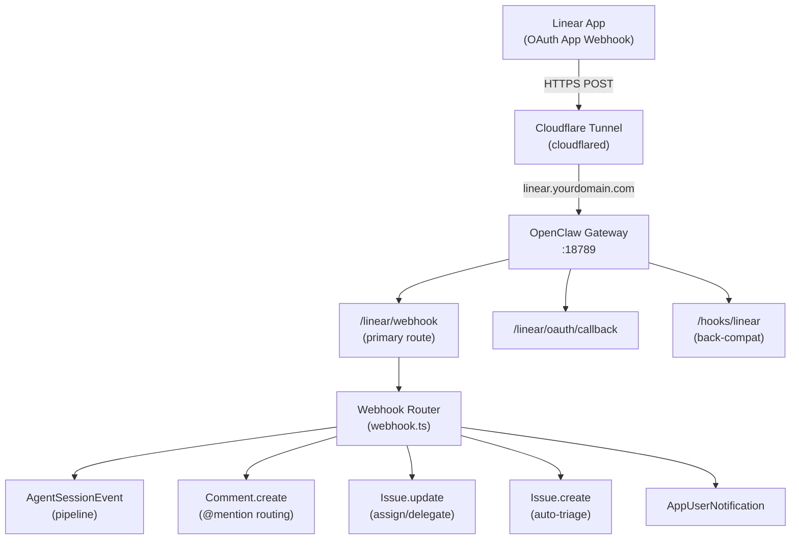
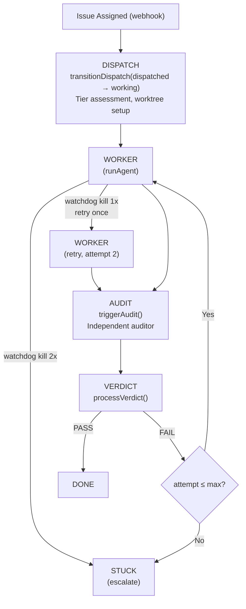
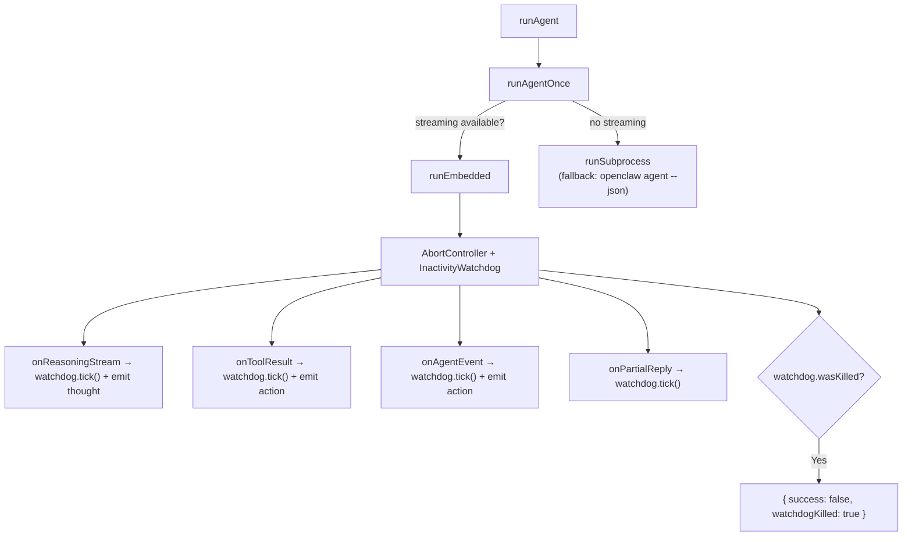
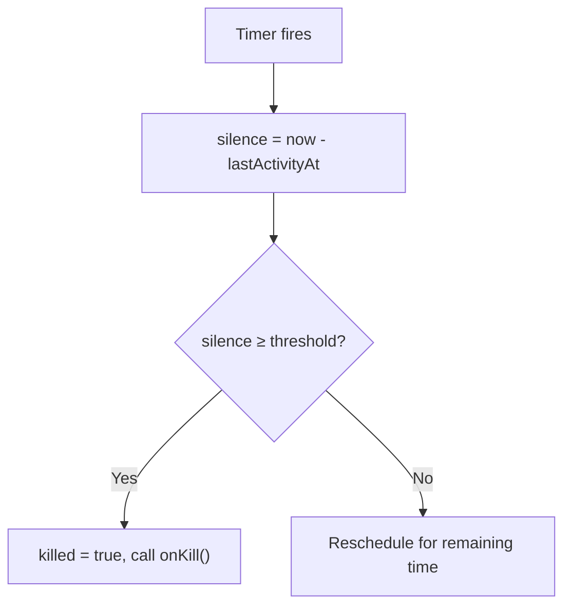
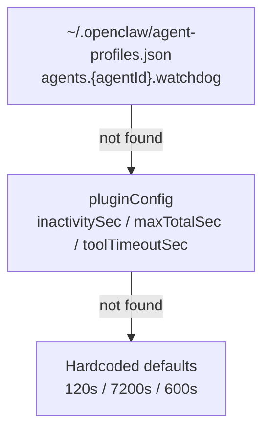
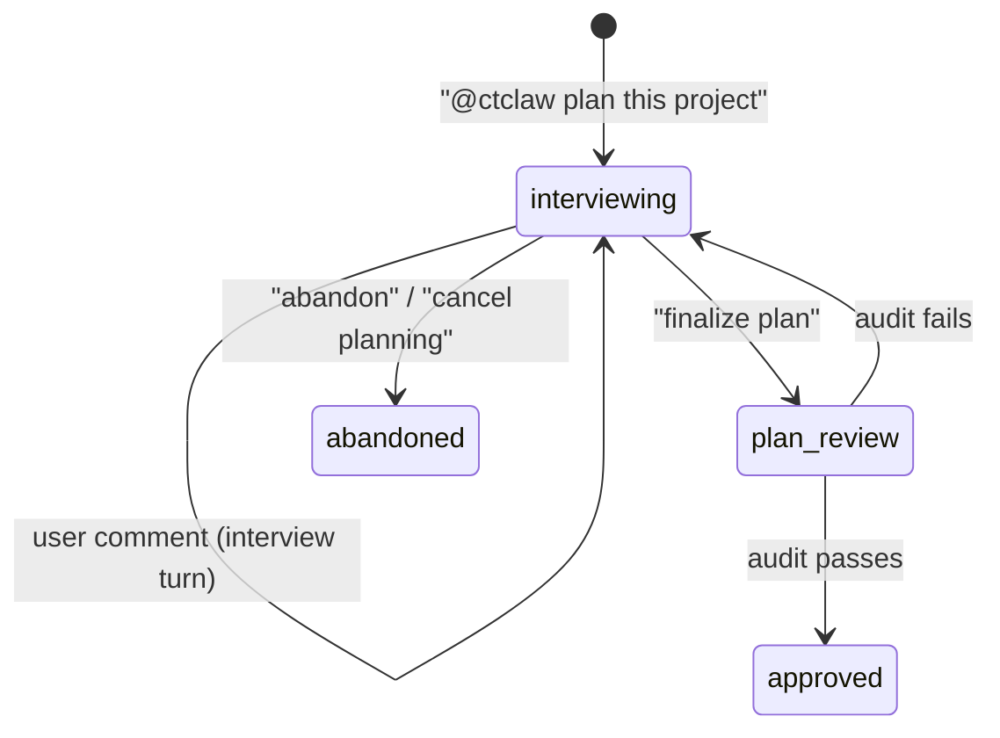
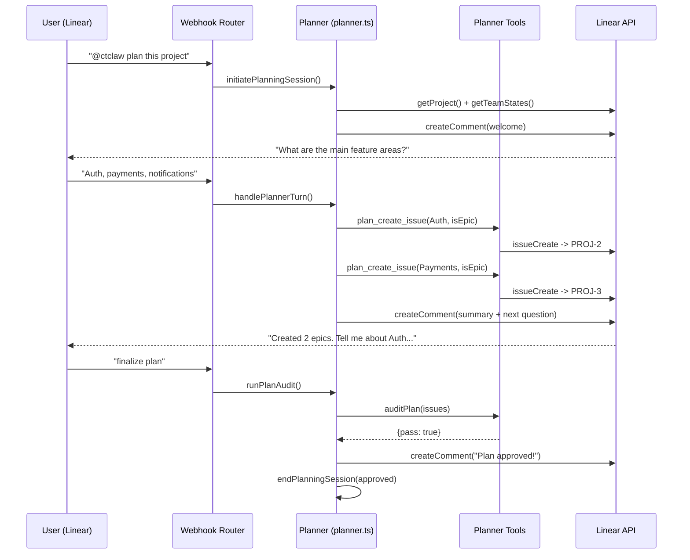
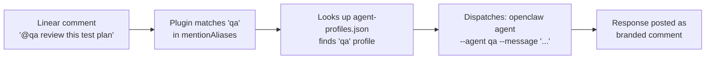
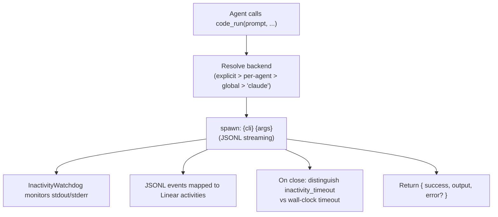
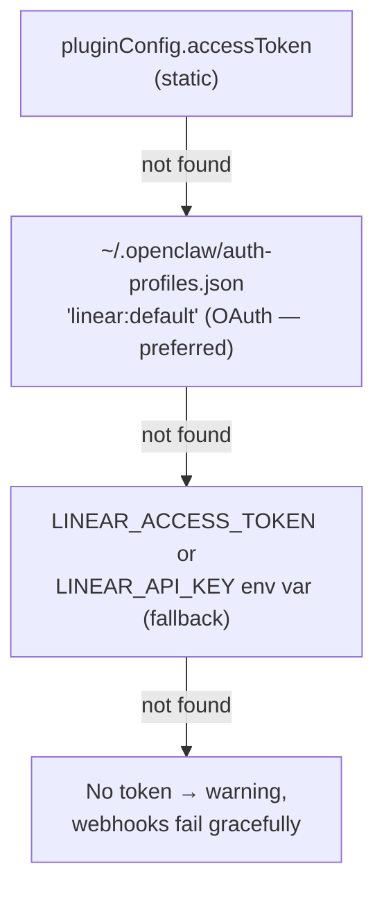

# Architecture

Internal reference for developers and maintainers of the Linear agent plugin.

---

## System Topology



## Webhook Event Types

All events arrive via POST. The router dispatches by `payload.type`:

| Event | Trigger | Handler |
|-------|---------|---------|
| `AgentSessionEvent.created` | Agent session opened in Linear UI | Full dispatch pipeline |
| `AgentSessionEvent.prompted` | User follow-up in existing session | Resume with streaming |
| `Comment.create` | `@mention` in a comment | Route to role-based agent |
| `Issue.create` | New issue created | Auto-triage (estimate, labels, priority) |
| `Issue.update` | Issue assigned/delegated to agent | Dispatch pipeline |
| `AppUserNotification` | Agent mentioned/assigned via OAuth app | Direct response |

All handlers respond `200 OK` within 5 seconds (Linear requirement), then process asynchronously.

**Payload structure differences:**
- Workspace events: `type=Comment action=create`, data at `payload.data`
- OAuth events: `type=AgentSessionEvent action=created`, session at `payload.agentSession`
- Important: `AgentSessionEvent`/`created`, NOT `AgentSession`/`create`

---

## Pipeline Stages



### Worker Phase (`spawnWorker`)

1. Transitions `dispatched -> working` (CAS)
2. Fetches issue details from Linear GraphQL API
3. Builds task prompt from `prompts.yaml` templates
4. Registers session mapping for `agent_end` hook
5. Calls `runAgent()` with streaming callbacks
6. Saves output to `.claw/worker-{N}.md`
7. Appends structured log to `.claw/log.jsonl`
8. If `watchdogKilled`: logs artifact, transitions to `stuck`, sends notification
9. Otherwise: triggers `triggerAudit()`

### Audit Phase (`triggerAudit`)

1. Dedup via `markEventProcessed()`
2. Transitions `working -> auditing` (CAS)
3. Builds audit prompt from `prompts.yaml`
4. Spawns independent auditor via `runAgent()`
5. Passes result to `processVerdict()`

### Verdict Phase (`processVerdict`)

1. Parses JSON verdict: `{"pass": true/false, "criteria": [...], "gaps": [...], "testResults": "..."}`
2. **Pass**: transition to `done`, write summary to `.claw/`, post approval comment
3. **Fail (retries left)**: transition back to `working`, increment attempt, re-spawn worker with gaps
4. **Fail (max reached)**: transition to `stuck`, post escalation comment, notify

---

## Agent Execution (`agent.ts`)

### Embedded Runner (primary)

Uses OpenClaw's `extensionAPI.runEmbeddedPiAgent()` for in-process execution with real-time streaming.



### Retry Wrapper

`runAgent()` wraps `runAgentOnce()` with retry-on-watchdog-kill:

1. First attempt runs normally
2. If `watchdogKilled: true`: log warning, emit Linear activity, retry once
3. Second failure: return as-is (caller handles escalation)
4. Non-watchdog failures: no retry

---

## Inactivity Watchdog (`watchdog.ts`)

### InactivityWatchdog Class

- `start()` -- begin watching (idempotent)
- `tick()` -- reset countdown (`lastActivityAt = Date.now()`)
- `stop()` -- clean shutdown
- `wasKilled` / `silenceMs` -- query state after completion

Timer uses dynamic rescheduling: calculates remaining time from last tick, not fixed polling. Minimum check interval: 1 second.

### Kill Flow



**onKill callback by context:**
- Embedded runner: `controller.abort()` + `ext.abortEmbeddedPiRun(sessionId)`
- CLI tools: `child.kill("SIGTERM")` + 5s `child.kill("SIGKILL")`

### Config Resolution



All config values are in **seconds**. The resolver converts to ms internally.

---

## Dispatch State (`dispatch-state.ts`)

File-backed persistent state at `~/.openclaw/linear-dispatch-state.json`:

```json
{
  "dispatches": {
    "active": { "API-123": { "status": "working", "attempt": 0, ... } },
    "completed": [ { "identifier": "API-122", "status": "done", ... } ]
  },
  "sessionMap": { "linear-worker-API-123-0": { "dispatchId": "API-123", "phase": "worker" } },
  "processedEvents": ["worker-end:...", "audit-end:..."]
}
```

### Atomic Operations

- **File locking**: exclusive lock before read-modify-write (30s stale threshold)
- **CAS transitions**: `transitionDispatch(id, expectedStatus, newStatus)` throws `TransitionError` on mismatch
- **Session mapping**: maps worker/audit session keys to dispatch context for `agent_end` hook lookup
- **Event dedup**: `markEventProcessed()` -- trimmed to last 200 entries

### Background Monitor (`dispatch-service.ts`)

Runs on 5-minute tick (zero LLM tokens):
1. **Stale detection**: marks dispatches inactive >2h as `stuck`
2. **Recovery**: finds dispatches with worker complete but audit missing
3. **Pruning**: removes completed entries older than 7 days

---

## Artifact System (`artifacts.ts`)

Per-worktree `.claw/` directory (gitignored):

| File | Content |
|------|---------|
| `manifest.json` | Issue metadata, tier, model, timestamps, status |
| `plan.md` | Implementation plan |
| `worker-{N}.md` | Worker output per attempt (truncated to 8KB) |
| `audit-{N}.json` | Audit verdict per attempt |
| `log.jsonl` | Append-only structured log (all phases including watchdog) |
| `summary.md` | Agent-curated final summary |

Summaries are also written to the orchestrator's `memory/` directory for long-term indexing.

---

## Project Planner Pipeline

Interactive planning mode for building Linear project issue hierarchies with dependency DAGs.

### State Machine



State lives in `~/.openclaw/linear-planning-state.json` (file-backed, same pattern as dispatch-state).

### Planning Flow



### Planner Tools (5 tools)

| Tool | Action |
|------|--------|
| `plan_create_issue` | Create issue/epic in project. Uses `GraphQL-Features: sub_issues` header for sub-issues. |
| `plan_link_issues` | Create `blocks`/`blocked_by`/`related` relations between issues |
| `plan_get_project` | Formatted tree snapshot of all project issues with relations |
| `plan_update_issue` | Update description, estimate, priority, labels on existing issue |
| `plan_audit` | Deterministic completeness audit (no LLM): descriptions, estimates, priorities, DAG cycles, orphans |

Tools use context injection (`setActivePlannerContext`/`clearActivePlannerContext`) -- set before `runAgent()`, cleared after. Same pattern as `active-session.ts`.

### DAG Audit Checks

The `auditPlan()` function is pure/deterministic (no LLM call):

1. All issues have descriptions >= 50 chars
2. Non-epic issues have estimates (not null)
3. Non-epic issues have priority > 0
4. No cycles in the dependency graph (Kahn's algorithm on blocks/blocked_by)
5. No orphan issues (everything has a parent or relation link)

### Dispatch Collision Prevention

While a project is in planning mode, the dispatch pipeline skips issues in that project. A comment explains: "This project is in planning mode. Finalize the plan before dispatching implementation."

---

## @Mention Routing



---

## Coding Tool Backends

The unified `code_run` tool dispatches to a configured CLI backend:



Backend-specific error types:
- `"timeout"` -- wall-clock timeout reached
- `"inactivity_timeout"` -- watchdog killed (no I/O)
- `"exit N"` -- CLI exited with non-zero code

---

## Agent Orchestration

| Tool | Behavior | Use Case |
|------|----------|----------|
| `spawn_agent` | Fire-and-forget | Parallel sub-tasks |
| `ask_agent` | Synchronous wait | Blocking questions |

Both use `runAgent()` under the hood.

---

## Token Resolution



OAuth tokens auto-refresh 60s before expiry. On 401, forces refresh and retries once.

**Auth header:** OAuth tokens use `Bearer` prefix; personal API keys do not.

---

## File Structure

```
linear/
|-- index.ts                  Entry point -- routes, tools, CLI, hooks, narration guard
|-- openclaw.plugin.json      Plugin metadata and config schema
|-- package.json
|-- prompts.yaml              Externalized prompt templates
|-- coding-tools.json         Backend configuration
|-- README.md
|-- docs/
|   |-- architecture.md       This file
|   +-- troubleshooting.md    Diagnostic commands and common issues
+-- src/
    |-- pipeline/              Core dispatch lifecycle
    |   |-- webhook.ts             Event router (6 handlers, dedup, dispatch)
    |   |-- pipeline.ts            v2 pipeline: spawnWorker, triggerAudit, processVerdict
    |   |-- dispatch-state.ts      File-backed state, CAS, session map, idempotency
    |   |-- dispatch-service.ts    Background monitor (stale, recovery, prune)
    |   |-- active-session.ts      In-memory session registry
    |   |-- tier-assess.ts         Complexity assessment (junior/medior/senior)
    |   |-- artifacts.ts           .claw/ directory artifacts + memory integration
    |   |-- planner.ts             Project planner orchestration (interview, audit)
    |   +-- planning-state.ts      File-backed planning state (mirrors dispatch-state)
    |
    |-- agent/                 Agent execution & monitoring
    |   |-- agent.ts               Embedded runner + subprocess, watchdog + retry
    |   +-- watchdog.ts            InactivityWatchdog class + config resolver
    |
    |-- tools/                 Tool registration & CLI backends
    |   |-- tools.ts               Tool registration (code_run + orchestration)
    |   |-- code-tool.ts           Unified code_run dispatcher
    |   |-- cli-shared.ts          Shared CLI helpers and defaults
    |   |-- claude-tool.ts         Claude Code runner (JSONL + watchdog)
    |   |-- codex-tool.ts          Codex runner (JSONL + watchdog)
    |   |-- gemini-tool.ts         Gemini runner (JSONL + watchdog)
    |   |-- orchestration-tools.ts spawn_agent / ask_agent
    |   +-- planner-tools.ts       5 planning tools + DAG audit + snapshot formatter
    |
    |-- api/                   Linear API & auth
    |   |-- linear-api.ts          GraphQL client, token resolution, auto-refresh
    |   |-- auth.ts                OAuth provider registration
    |   +-- oauth-callback.ts      OAuth callback handler
    |
    +-- infra/                 Infrastructure utilities
        |-- cli.ts                 CLI subcommands
        |-- codex-worktree.ts      Git worktree management
        +-- notify.ts              Multi-channel notifier (Discord, Slack, Telegram, Signal)
```
